# Holmes CTF: "The Enduring Echo" 🔊

**👤 Author:** Benjamin Taylor ([@benjqminn](https://github.com/benjqminn))

**🤝 Team:** Sherlock's Homies
- [Benjamin Taylor](https://www.linkedin.com/in/btayl106/)  
- [Greyson Brummer](https://www.linkedin.com/in/greyson-brummer-b82119301/)  
- [Jonathan Lutabingwa](https://www.linkedin.com/in/jonathan-lutabingwa/)  
- [Lansina Diakite](https://www.linkedin.com/in/lansina-diakite-7a673b202/)  
- [Shaunak Peri](https://www.linkedin.com/in/shaunak-peri-315744245/)

**🏆 Ranking**: 634 / 7,085 teams

**📝 Prompt:** LeStrade passes a disk image artifacts to Watson. It's one of the identified breach points, now showing abnormal CPU activity and anomalies in process logs.

**📌 Summary:** Actor “JM” breached Nicole Vale’s honeypot via web shell, stole credentials, set up persistence, and pivoted into the internal network. Evidence came from memory, bash history, configs, and process analysis.

**🟩 Challenge Difficulty:** *EASY*

---

## 📋 TL;DR (Answers)

- **First command (non-cd):** `systeminfo`
- **Parent process (full path):** `C:\Windows\system32\wbem\wmiprvse.exe`
- **Remote-exec tool:** `wmiexec.py`
- **Attacker IP:** `x.x.x.x`
- **First persistence element:** `<string>`
- **Script executed by persistence:** `C:\FOLDER\PATH\FILE.ext`
- **Local account created:** `<username>`
- **Exfil domain:** `<domain>`
- **Password generated:** `<password>`
- **Internal pivot IP:** `x.x.x.x`
- **Forwarded TCP port:** `<port>`
- **Registry path for mappings:** `HKLM\...\...`
- **MITRE ATT&CK ID for pivot technique:** `Txxxx.xxx`
- **Command to enable command-line logging (pre-attack):** `<command>`

---

## 🚩 Flag 1: First Command

**Question:** What was the first (non cd) command executed by the attacker on the host? (string) 

**Walkthrough:** 
- To start this challenge, all we are given is a `.zip` file named `The_Enduring_Echo.zip`.
- Navigating to the `winevt` logs, the first place I assumed to check for the "non cd" command executed by the attacker was `Security.evtx`.

- Opening the Event Viewer, we can filter this log for Event ID `4688`, aka `Process Creation` events only.
- Since we know from previous challenges that the attacker is using the "Heisen-9-WS-6" computer that he gained credentials to, we can use the `Computer(s)` field to check only the logs containing this computer.

- Now, to narrow our search down even more, we can use the `Find` feature to search for only logs containing a `CommandLine` field.

- After skimming through the logs given, we see that on `8/24/2025 6:51:09 PM`, there is a log with Event ID `4688` being the first `CommandLine` text of this session.
- Cross-referencing with other log activity, this seems to be the time at which the attacker made their way onto the host.

- You can see that the "Process Command Line" value is `systeminfo`.

**Answer:** `systeminfo`  

---

## 🚩 Flag 2: 

**Question:** Which parent process (full path) spawned the attacker’s commands? (C:\FOLDER\PATH\FILE.ext) 

**Walkthrough:** 
- To find Flag 2, we are going to be looking through the `Security.evtx` logs some more.
- Since I was trying to find these flags using the Event Viewer alone, I first tried some `Find` keywords that would be more obvious indicators of the parent process spawning the commands of the attacker.

- Trying the search query `wmi` proved successful: since `WMIPrvSE.exe` can run code on behalf of remote callers, and `WMI` can execute commands without dropping files, it was one of the queries I searched for.

-  We can see in this specific log at `8/20/2025 12:48:05 PM` that the "Process Command Line" value is `C:\Windows\system32\wbem\wmiprvse.exe`.
-  Although this flag was found through trial and error, common sense was the key driving factor of my search queries, and it turned up successful.

**Answer:** `C:\Windows\system32\wbem\wmiprvse.exe`  

---

## 🚩 Flag 3: 

**Question:** Which remote-execution tool was most likely used for the attack? (filename.ext)  

**Walkthrough:** 
- For Flag 3, we know from the previous question that the attacker was using `WmiPrvSE.exe` as their parent process of suspicious commands.
- `WmiPrvSE.exe` is found within the `wmiexec` module, which is run or called from the `wmiexec.py` script.
- Using deduction, the third flag is `wmiexec.py`.

**Answer:** `wmiexec.py`  

---

## 🚩 Flag 4: 

**Question:** What was the attacker’s IP address? (IPv4 address)

**Walkthrough:** 
- To find Flag 4, we will be leveraging the `Security.evtx` logs once again.
- Whenever the attacker logs onto the network, there is bound to be a `Logon` event left behind with the attacker's machine information.
- To try and find this said event, we can search for Event ID `4624`, the indicator that "an account was successfully logged on".

- The time of the "first command" executed by the attacker for Flag 1 was `8/24/2025 6:51:09 PM`.
- This is a good time range to start looking around.
- About 30 minutes after the first command was executed, there is a `Logon` event in which a "Source Network Address" can be found under the "Network Information" section.

- The IPv4 address listed is most definitely the attacker's IP address, as it lines up with the timeline of the attack and what times the attacker was logged in.

**Answer:** `10.129.242.110`  

---

## 🚩 Flag 5: 

**Question:** What is the first element in the attacker's sequence of persistence mechanisms? (string)  

**Walkthrough:** 
- Earlier, when I was inspecting the provided files for this challenge, I found a folder named `Tasks`.
- The file path for this folder was `The_Enduring_Echo\C\Windows\System32\Tasks`.

- This folder contains multiple files that are "scheduled task definitions", essentially created when the attacker makes a scheduled task that runs at boot/on a schedule.
- In other words, these are classic persistence mechanisms.
- Starting from the bottom, I first inspected `SysHelper Update` (the only task that wasn't OneDrive-related or MicrosoftEdge-related).
- Opening the `Security.evtx` logs, I filtered the logs for Event ID `4688`, aka `Process Creation` events only.

- With the `Process Creation` events all listed again, I searched using the `Find` action for the string `SysHelper Update` to narrow down my search to logs containing this scheduled task.

- The first log highlighted seemed like one of interest: upon expanding it, there is a command that (1) creates a scheduled task by the name `SysHelper Update`, (2) specifies the action the task runs, (3) runs as SYSTEM, and (4) schedules it to run every 4 minutes, and redirects the output to an administrative share.

- These are all key indicators of a persistence mechanism.
- The time also correlates with the time the attacker was in the system, this log being created at `8/24/2025 7:03:50 PM`.
- Looking at the previous logs in this time frame, there also seemed to be nothing unusual related to persistence mechanisms.
- Therefore, the first element in the sequence of persistence mechanisms is `SysHelper Update`.

**Answer:** `SysHelper Update` 

---

## 🚩 Flag 6: Tools + Malware

**Question:** How many tools and malware in total are linked to the previously identified campaigns?  

**Walkthrough:** 
- The answer to this flag lies within the same graph that we used for the previous question. 

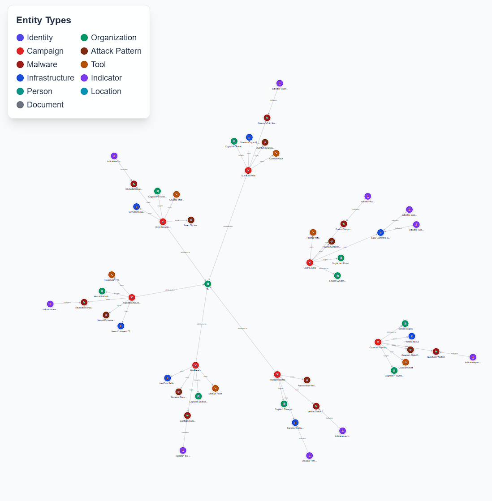
- As you can see in the image, there is an "Entity Types" legend that specifies the type of entities that are found in the graph.
- The question is asking for "tools" and "malware" specifically.
- If we zoom in on the campaigns surrounding the honeypot (5 campaigns in particular), we can count `4 tools` and `5 malware` used.
- Adding these together, 4 + 5, gives us our flag: `9`.

**Answer:** `9`  

---

## 🚩 Flag 7: SHA-256 Hash

**Question:** The threat actor has always used the same malware in their campaigns. What is its SHA-256 hash?  

**Walkthrough:** 
- Using the same `IP:port` combo as the previous two questions, this question requires us to look a little deeper into the malware used in the attacks.
- Searching the graph for `4A4D`, the malware that the attacker has used throughout the campaigns, shows us that there are 11 entities and 3 different types associated. 

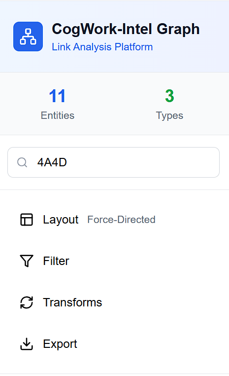
- This means that all of these entities, including one organization, 5 campaigns, and 5 malware, are all associated with `4A4D`. 

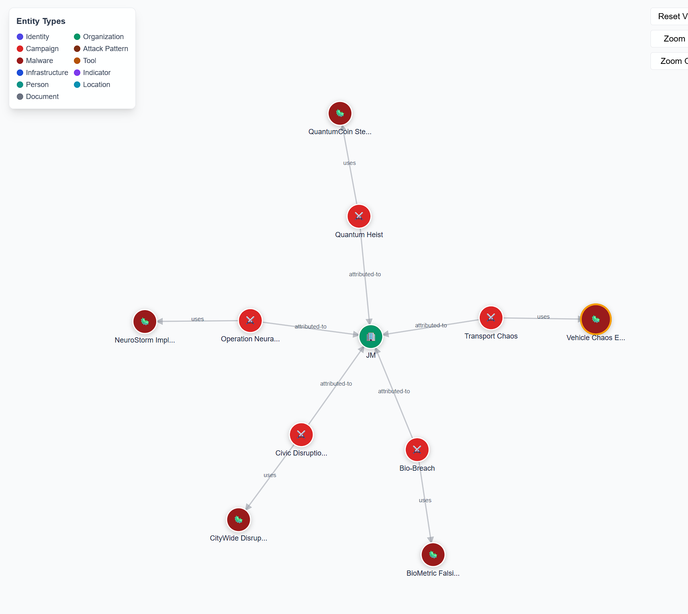
- If we inspect any of the malware used, they all link to a weird Indicator named `indicator--vehicle-chaos-hash-2025-0005`. In this case, I chose the `Vehicle Chaos Engine` malware and went to the "Links" section.

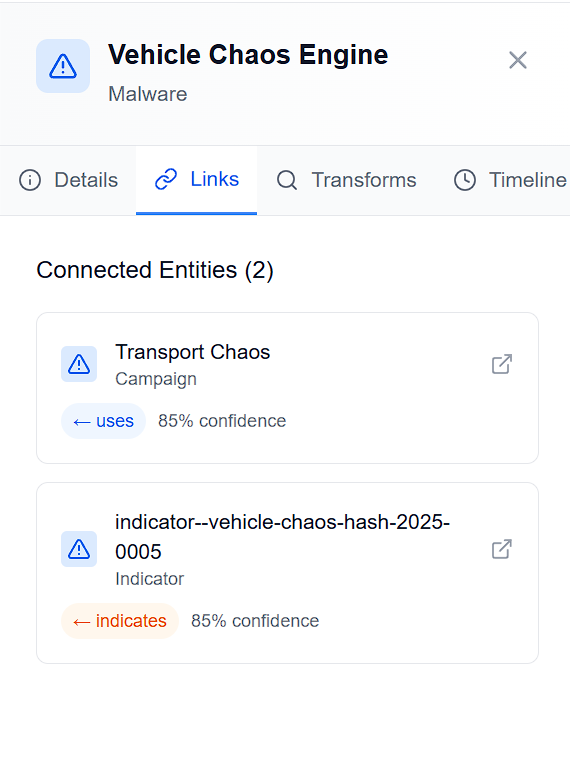
- Further inspection of this Indicator takes us to the `indicator--vehicle-chaos-hash-2025-0005` page.
- If we go to the "Details" pane, there is a "Pattern" listed in the properties.
- The pattern listed is `[file:hashes.SHA256 = '7477c4f5e6d7c8b9a0f1e2d3c4b5a6f7e8d9c0b1a2f3e4d5c6b7a8f9e0d17477']`.
- If we look deeper into this, there is a SHA256 hash embedded. This is the correct flag for the question.
- Flag / SHA-256 Hash: `7477c4f5e6d7c8b9a0f1e2d3c4b5a6f7e8d9c0b1a2f3e4d5c6b7a8f9e0d17477`.

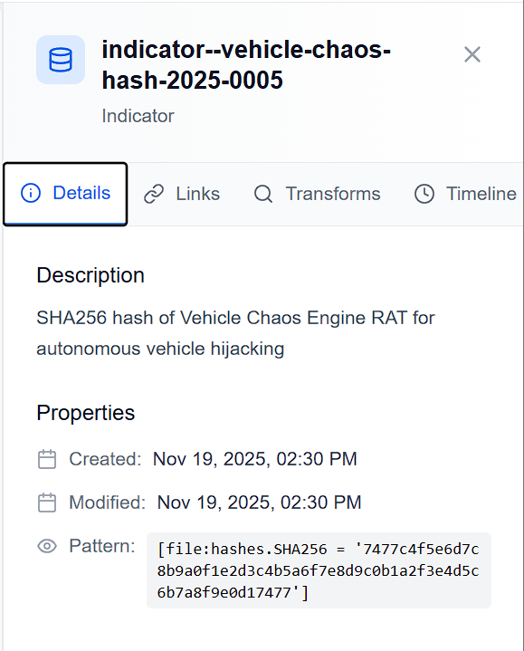

**Answer:** `7477c4f5e6d7c8b9a0f1e2d3c4b5a6f7e8d9c0b1a2f3e4d5c6b7a8f9e0d17477`  

---

## 🚩 Flag 8: C2 IP Address

**Question:** Use the CogWork Security Platform to look for the hash and locate the IP address to which the malware connects.  

**Walkthrough:** 
- Now that we have the SHA-256 value from the previous flag, we are tasked with locating the IP address to which the malware connects.
- On the "CogWork Security" website that the new `IP:port` took us to, we `CTRL + C` the SHA-256 and then `CTRL + V` into the search query box.

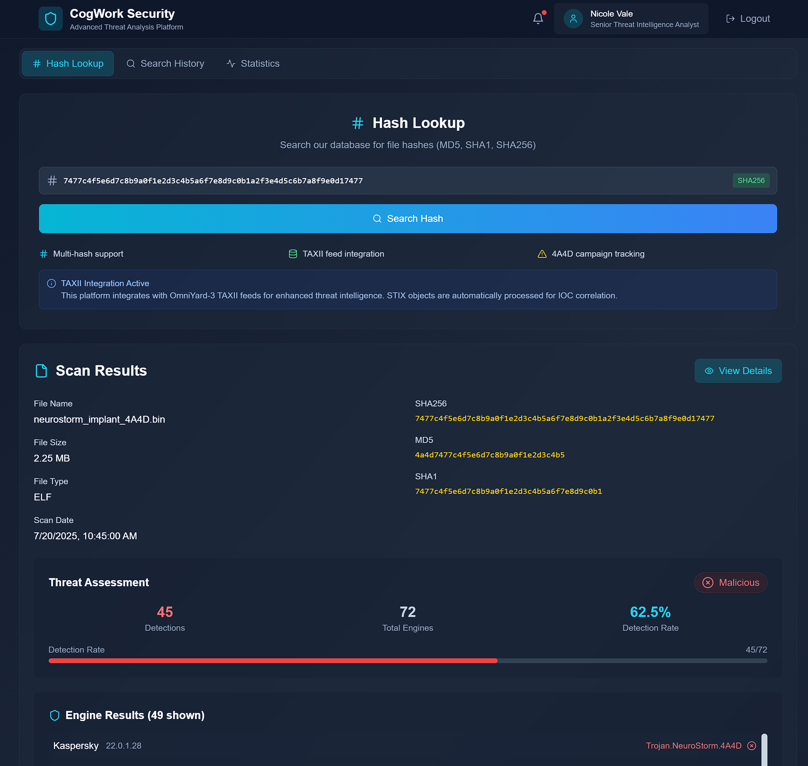
- We can see here that this is not only a `Malicious` threat, but the filename also matches the `4A4D` pattern that we have been seeing throughout this activity. This means it is most definitely the correct file.
- Clicking "View Details" takes us to a more specific breakdown of the file:

- We can see here that an HTTPS IP address is given, and after submission we find out this is the correct value.
- Therefore, the flag (and IP address to which the malware connects) is `74.77.74.77`.

**Answer:** `74.77.74.77`  

---

## 🚩 Flag 9: Persistence File Path

**Question:** What is the full path of the file that the malware created to ensure its persistence on systems?  

**Walkthrough:** 
- Continuing off of the previous question, the flag for this question is found right below the last answer.
- The question is asking for the file path to ensure persistence on systems, and if we scroll down we see a field titled "File Operations".

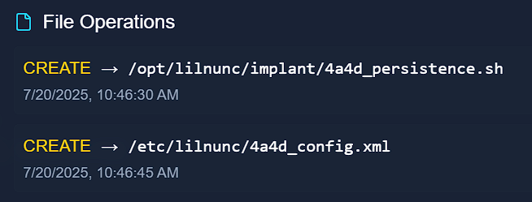
- In this section, there are two `CREATE` operations. The first of which has "persistence" in the name.
- It is safe to assume that this is the correct file path for system persistence.
- Therefore, the flag (and file path to ensure system persistence) is `/opt/lilnunc/implant/4a4d_persistence.sh`.

**Answer:** `/opt/lilnunc/implant/4a4d_persistence.sh`  

---

## 🚩 Flag 10: Open Ports

**Question:** CogNet Scanner — how many open ports does the server have?  

**Walkthrough:** 
- For this task, we are given a third and final `IP:port` address and told to use the CogNet Scanner Platform to find more details about the infrastructure of the TA.

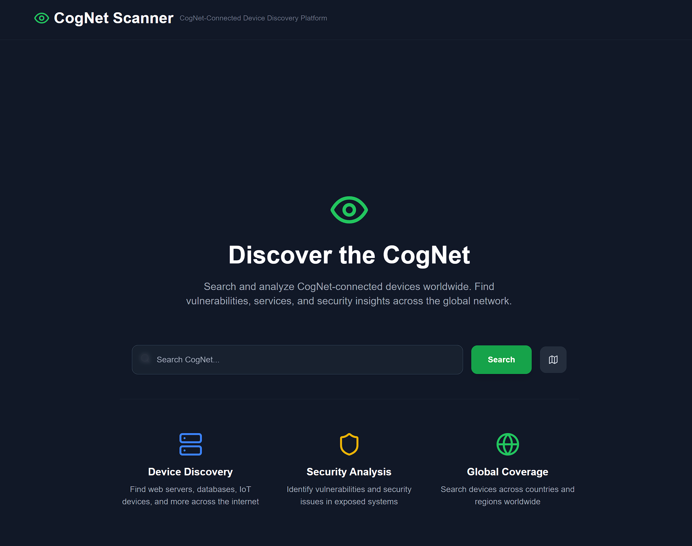
- Searching the CogNet Scanner Platform with the IP address we found in a previous flag, `74.77.74.77`, returns one single result.
- This search page contains some open ports and even some vulnerabilities with CVSS scores of 8.8 and 9.7 out of 10. It seems we are dealing with a pretty dangerous target.
- Clicking on the "Details" button, we are taken to a more in-depth breakdown of the information regarding this target.
- We can see from this page the number of open ports, which is what this question is asking for.

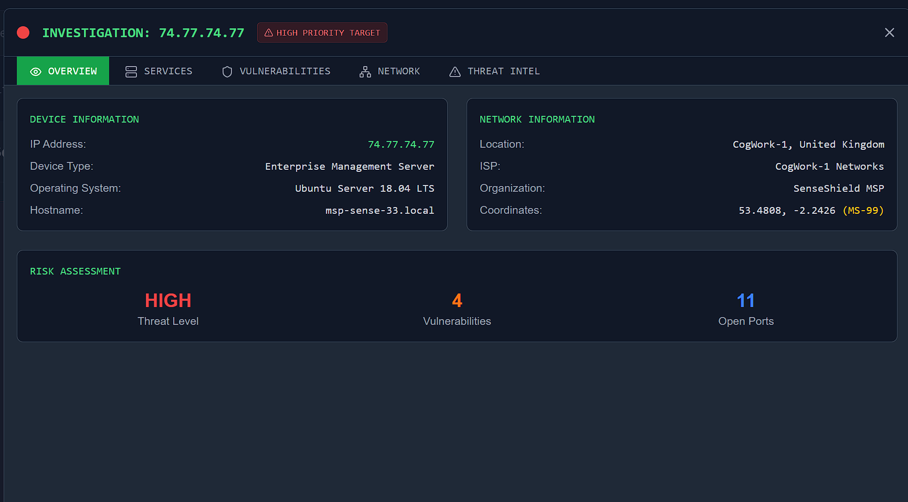
- Therefore, the flag (and number of open ports) is `11`.

**Answer:** `11`  

---

## 🚩 Flag 11: Organization

**Question:** Which organization does the previously identified IP belong to?  

**Walkthrough:** 
- The answer to this flag is right above the number of open ports from the previous question. 

- As you can see in the image, under the "Network Information" section, there is a list of information pertaining this target.
- This information contains Location, ISP, Organization, and Coordinates.
- We want to find the organization for this question, which is listed in this section as `SenseShield MSP`.
- Therefore, the flag (and organization) is `SenseShield MSP`.

**Answer:** `SenseShield MSP`  

---

## 🚩 Flag 12: Cryptic Banner

**Question:** One of the exposed services displays a banner containing a cryptic message. What is it?  

**Walkthrough:** 
- Using the same CogNet scan, we can find more information about this target.
- I navigated to the "Services" tab on the top navigation pane, and was met with more details on some ports and services.

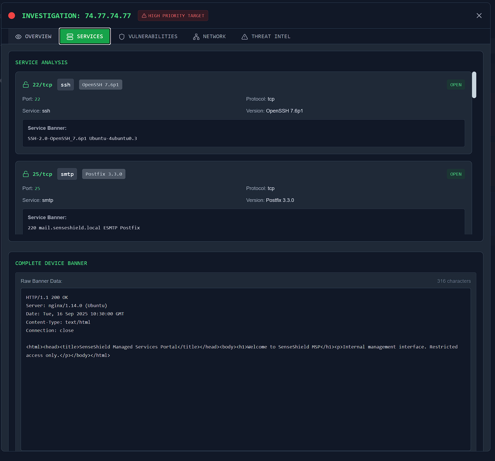
- This question is asking for a banner containing a cryptic message, so my thought process was to scroll through until I found something weird or out of the ordinary.
- Scrolling through the services provided, I found one that stood out: `7477/tcp`.
- This was an unknown service with an unknown version, running on Port 7477 and using TCP protocol.

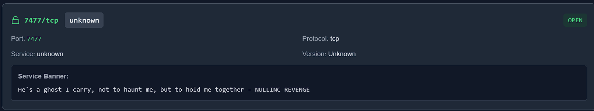
- This seemed to be it. The Service Banner displayed was: `He's a ghost I carry, not to haunt me, but to hold me together - NULLINC REVENGE`.

**Answer:** `He's a ghost I carry, not to haunt me, but to hold me together - NULLINC REVENGE`  

---

**Next challenge writeup:** [Holmes — The Watchman's Residue 👮](./holmes_watchmans_residue.md)
