# Holmes CTF: "The Enduring Echo" 🔊

**👤 Author:** Benjamin Taylor ([@benjqminn](https://github.com/benjqminn))

**🤝 Team:** Sherlock's Homies
- [Benjamin Taylor](https://www.linkedin.com/in/btayl106/)  
- [Greyson Brummer](https://www.linkedin.com/in/greyson-brummer-b82119301/)  
- [Jonathan Lutabingwa](https://www.linkedin.com/in/jonathan-lutabingwa/)  
- [Lansina Diakite](https://www.linkedin.com/in/lansina-diakite-7a673b202/)  
- [Shaunak Peri](https://www.linkedin.com/in/shaunak-peri-315744245/)

**🏆 Ranking**: 634 / 7,085 teams

**📝 Prompt:** LeStrade passes a disk image artifacts to Watson. It's one of the identified breach points, now showing abnormal CPU activity and anomalies in process logs.

**📌 Summary:** Actor “JM” breached Nicole Vale’s honeypot via web shell, stole credentials, set up persistence, and pivoted into the internal network. Evidence came from memory, bash history, configs, and process analysis.

**🟩 Challenge Difficulty:** *EASY*

---

## 📋 TL;DR (Answers)

- **First command (non-cd):** `systeminfo`
- **Parent process (full path):** `C:\Windows\system32\wbem\wmiprvse.exe`
- **Remote-exec tool:** `wmiexec.py`
- **Attacker IP:** `10.129.242.110`
- **First persistence element:** `SysHelper Update`
- **Script executed by persistence:** `C:\Users\Werni\AppData\Local\JM.ps1`
- **Local account created:** `svc_netupd`
- **Exfil domain:** `NapoleonsBlackPearl.htb`
- **Password generated:** `Watson_20250824160509`
- **Internal pivot IP:** `192.168.1.101`
- **Forwarded TCP port:** `9999`
- **Registry path for mappings:** `HKLM\SYSTEM\CurrentControlSet\Services\PortProxy\v4tov4\tcp`
- **MITRE ATT&CK ID for pivot technique:** `T1090.001`
- **Command to enable command-line logging (pre-attack):**  
  `reg add "HKLM\Software\Microsoft\Windows\CurrentVersion\Policies\System\Audit" /v ProcessCreationIncludeCmdLine_Enabled /t REG_DWORD /d 1 /f`

---

## 🚩 Flag 1: Initial Command

**Question:** What was the first (non cd) command executed by the attacker on the host? (string) 

**Walkthrough:** 
- To start this challenge, all we are given is a `.zip` file named `The_Enduring_Echo.zip`.
- Navigating to the `winevt` logs, the first place I assumed to check for the "non cd" command executed by the attacker was `Security.evtx`.

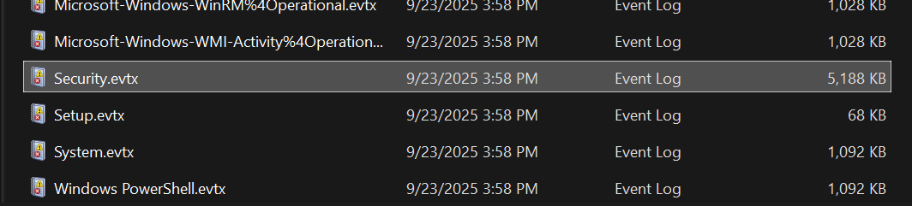
- Opening the Event Viewer, we can filter this log for Event ID `4688`, aka `Process Creation` events only.
- Since we know from previous challenges that the attacker is using the "Heisen-9-WS-6" computer that he gained credentials to, we can use the `Computer(s)` field to check only the logs containing this computer.

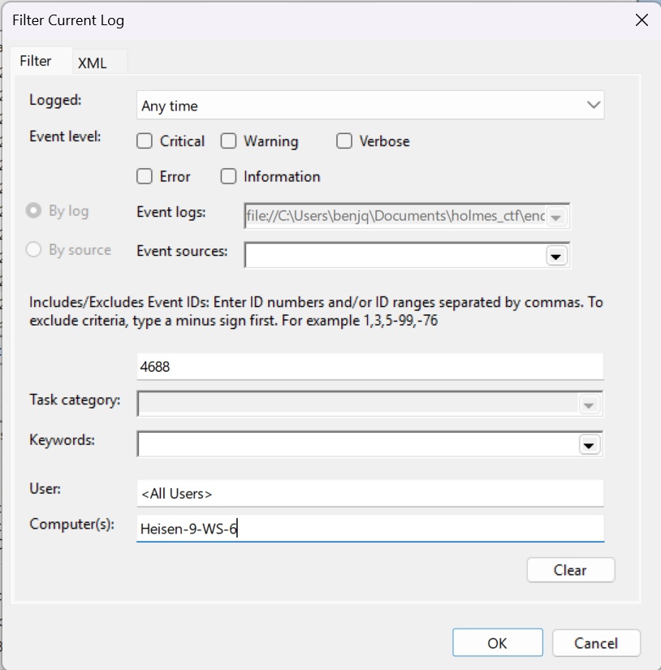
- Now, to narrow our search down even more, we can use the `Find` feature to search for only logs containing a `CommandLine` field.

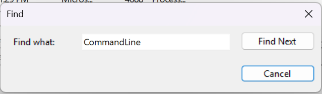
- After skimming through the logs given, we see that on `8/24/2025 6:51:09 PM`, there is a log with Event ID `4688` being the first `CommandLine` text of this session.
- Cross-referencing with other log activity, this seems to be the time at which the attacker made their way onto the host.

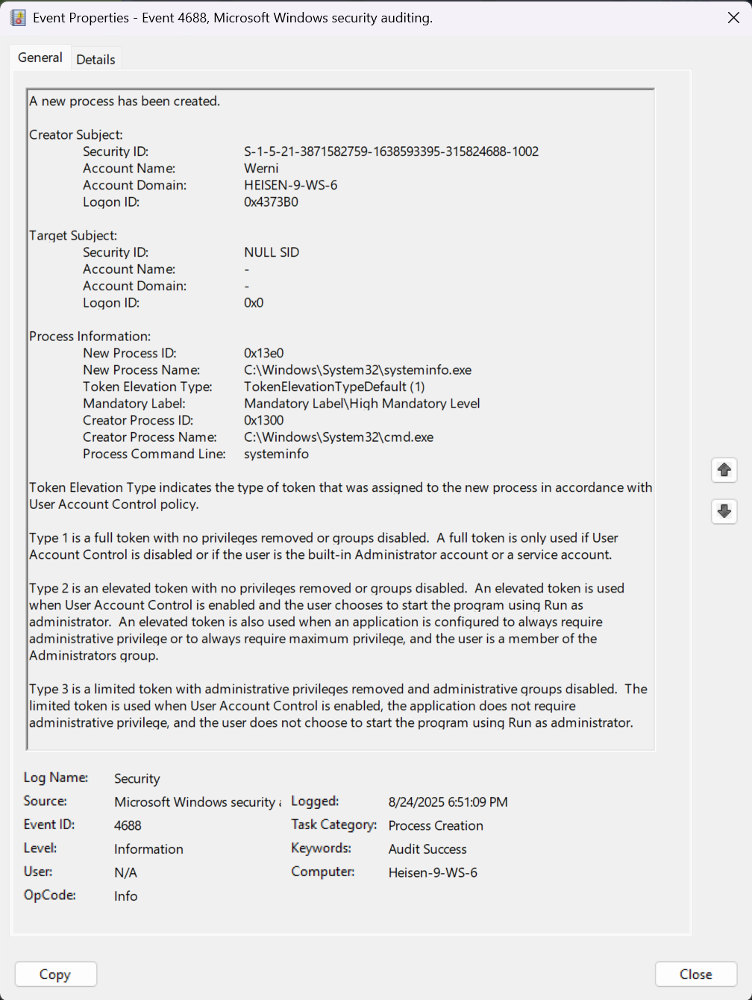
- You can see that the "Process Command Line" value is `systeminfo`.

**Answer:** `systeminfo`  

---

## 🚩 Flag 2: Parent Process

**Question:** Which parent process (full path) spawned the attacker’s commands? (C:\FOLDER\PATH\FILE.ext) 

**Walkthrough:** 
- To find Flag 2, we are going to be looking through the `Security.evtx` logs some more.
- Since I was trying to find these flags using the Event Viewer alone, I first tried some `Find` keywords that would be more obvious indicators of the parent process spawning the commands of the attacker.

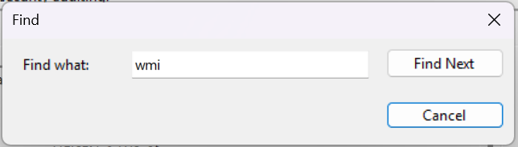
- Trying the search query `wmi` proved successful: since `WMIPrvSE.exe` can run code on behalf of remote callers, and `WMI` can execute commands without dropping files, it was one of the queries I searched for.

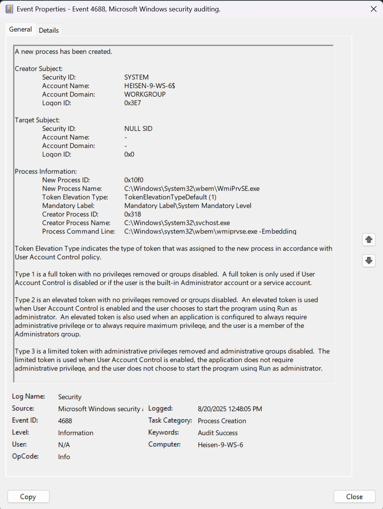
-  We can see in this specific log at `8/20/2025 12:48:05 PM` that the "Process Command Line" value is `C:\Windows\system32\wbem\wmiprvse.exe`.
-  Although this flag was found through trial and error, common sense was the key driving factor of my search queries, and it turned up successful.

**Answer:** `C:\Windows\system32\wbem\wmiprvse.exe`  

---

## 🚩 Flag 3: Remote Exec

**Question:** Which remote-execution tool was most likely used for the attack? (filename.ext)  

**Walkthrough:** 
- For Flag 3, we know from the previous question that the attacker was using `WmiPrvSE.exe` as their parent process of suspicious commands.
- `WmiPrvSE.exe` is found within the `wmiexec` module, which is run or called from the `wmiexec.py` script.
- Using deduction, the third flag is `wmiexec.py`.

**Answer:** `wmiexec.py`  

---

## 🚩 Flag 4: Attacker IP

**Question:** What was the attacker’s IP address? (IPv4 address)

**Walkthrough:** 
- To find Flag 4, we will be leveraging the `Security.evtx` logs once again.
- Whenever the attacker logs onto the network, there is bound to be a `Logon` event left behind with the attacker's machine information.
- To try and find this said event, we can search for Event ID `4624`, the indicator that "an account was successfully logged on".

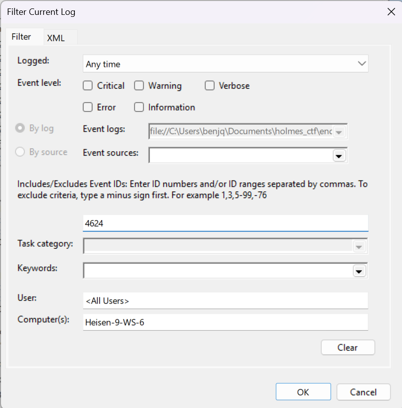
- The time of the "first command" executed by the attacker for Flag 1 was `8/24/2025 6:51:09 PM`.
- This is a good time range to start looking around.
- About 30 minutes after the first command was executed, there is a `Logon` event in which a "Source Network Address" can be found under the "Network Information" section.

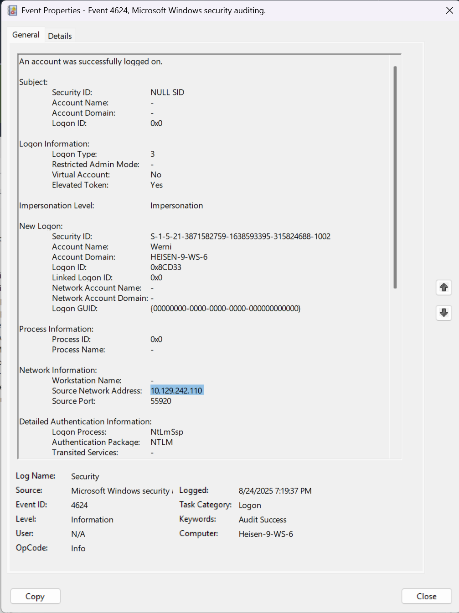
- The IPv4 address listed is most definitely the attacker's IP address, as it lines up with the timeline of the attack and what times the attacker was logged in.

**Answer:** `10.129.242.110`  

---

## 🚩 Flag 5: First Persistence

**Question:** What is the first element in the attacker's sequence of persistence mechanisms? (string)  

**Walkthrough:** 
- Earlier, when I was inspecting the provided files for this challenge, I found a folder named `Tasks`.
- The file path for this folder was `The_Enduring_Echo\C\Windows\System32\Tasks`.

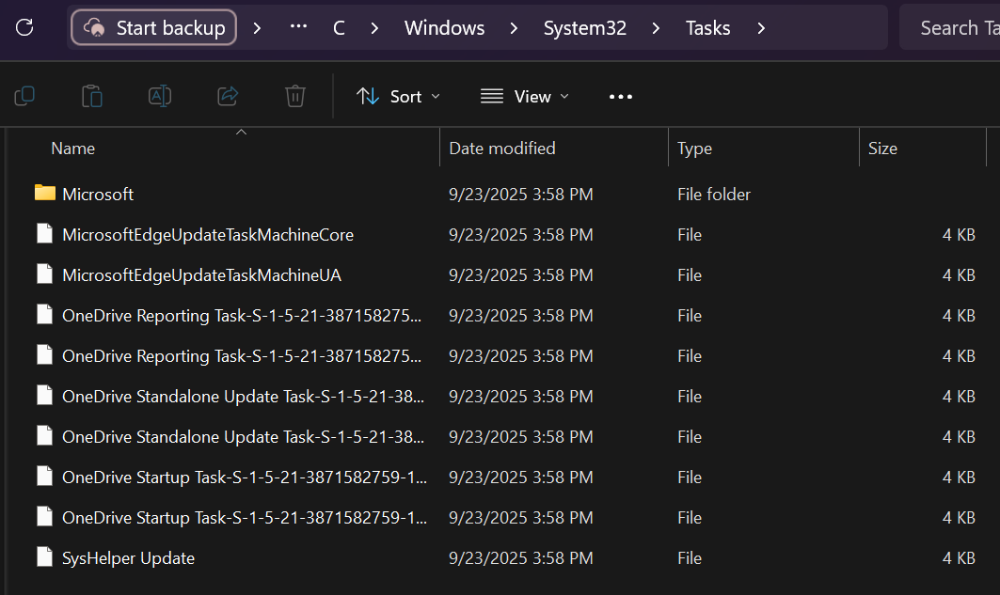
- This folder contains multiple files that are "scheduled task definitions", essentially created when the attacker makes a scheduled task that runs at boot/on a schedule.
- In other words, these are classic persistence mechanisms.
- Starting from the bottom, I first inspected `SysHelper Update` (the only task that wasn't OneDrive-related or MicrosoftEdge-related).
- Opening the `Security.evtx` logs, I filtered the logs for Event ID `4688`, aka `Process Creation` events only.

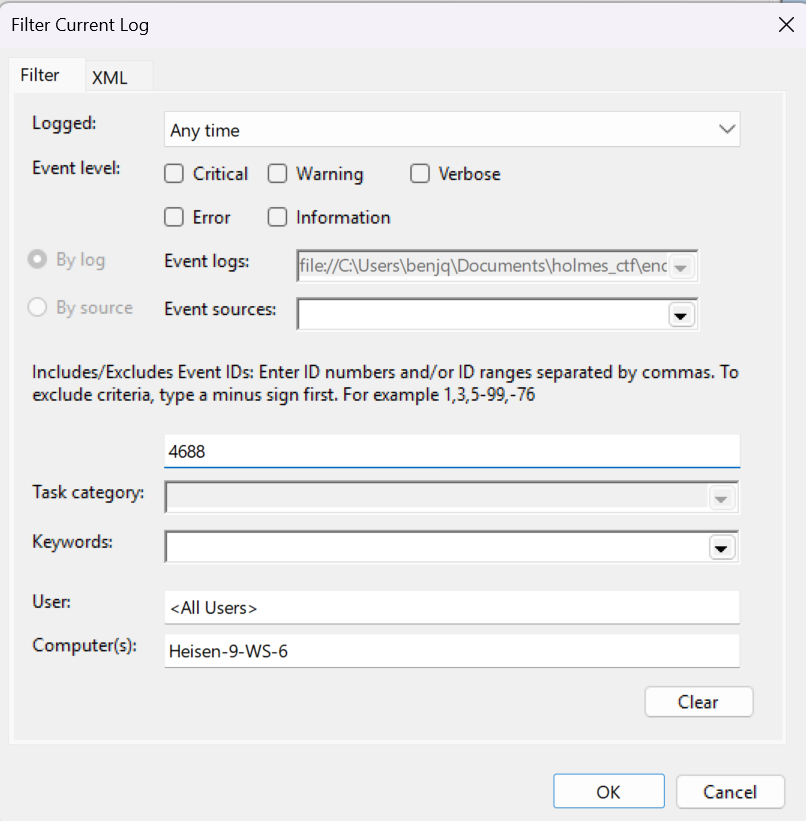
- With the `Process Creation` events all listed again, I searched using the `Find` action for the string `SysHelper Update` to narrow down my search to logs containing this scheduled task.

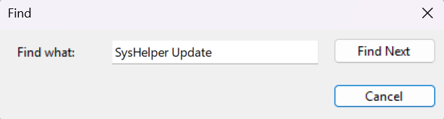
- The first log highlighted seemed like one of interest: upon expanding it, there is a command that (1) creates a scheduled task by the name `SysHelper Update`, (2) specifies the action the task runs, (3) runs as SYSTEM, and (4) schedules it to run every 4 minutes, and redirects the output to an administrative share.

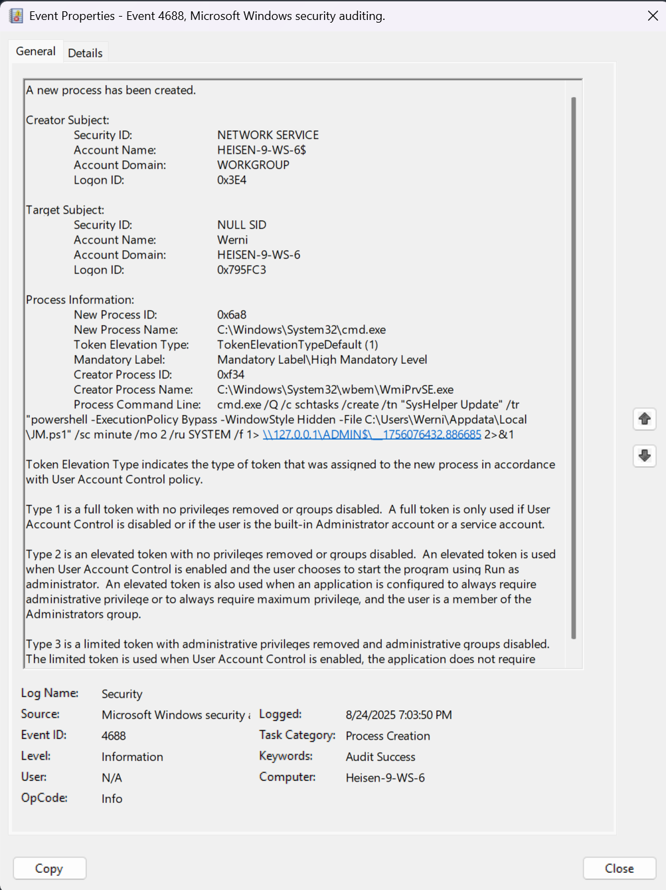
- These are all key indicators of a persistence mechanism.
- The time also correlates with the time the attacker was in the system, this log being created at `8/24/2025 7:03:50 PM`.
- Looking at the previous logs in this time frame, there also seemed to be nothing unusual related to persistence mechanisms.
- Therefore, the first element in the sequence of persistence mechanisms is `SysHelper Update`.

**Answer:** `SysHelper Update` 

---

## 🚩 Flag 6: Persistence Script

**Question:** Identify the script executed by the persistence mechanism. (C:\FOLDER\PATH\FILE.ext)

**Walkthrough:** 
- Finding Flag 6 is simple, as the answer lies in the log from the previous question.
- Looking at the command from the `SysHelper Update` schedule task creation command, the script and path are also specified.

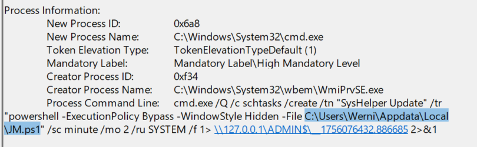

**Answer:** `C:\Users\Werni\Appdata\Local\JM.ps1`  

---

## 🚩 Flag 7: Created Account

**Question:** What local account did the attacker create? (string) 

**Walkthrough:** 
- To find a new local account created in the `Security.evtx` logs, we can filter by Event ID `4720`.
- Specifically, Event ID `4720` returns "A user account was created" events.

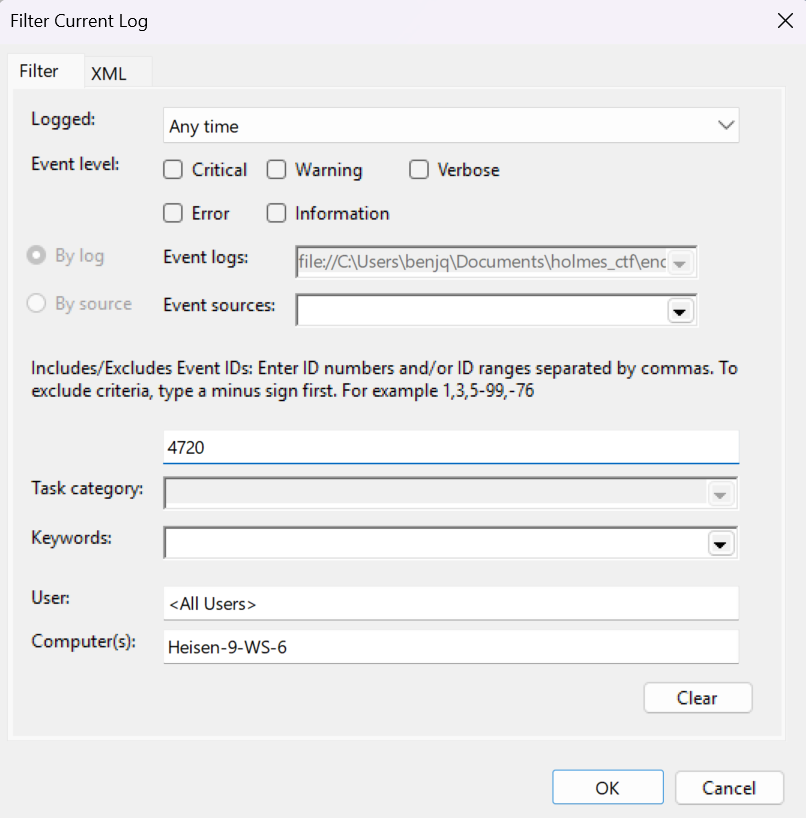
- After filtering the logs, there is only one log returned with Event ID `4720`.

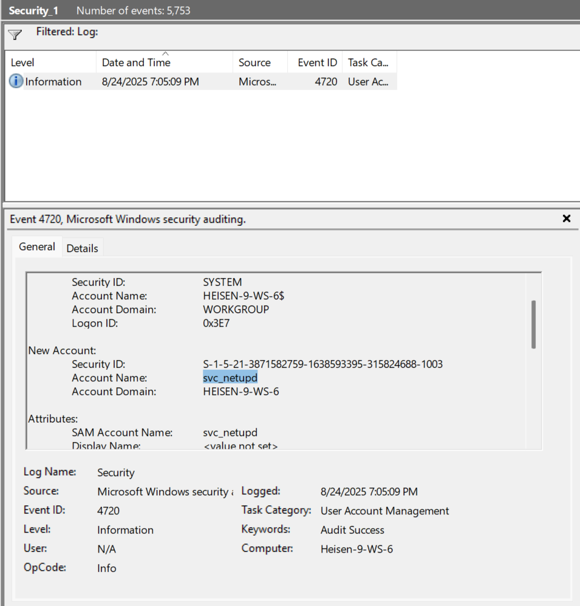
- Looking under the "Attributes" characteristics, we can see the "SAM Account Name" is `svc_netupd`.

**Answer:** `svc_netupd`  

---

## 🚩 Flag 8: Exfil Domain

**Question:** What domain name did the attacker use for credential exfiltration? (domain)
 
**Walkthrough:** 
- To find the domain name that the attacker used for credential exfiltration, checking through the files for related files was the first step I took.

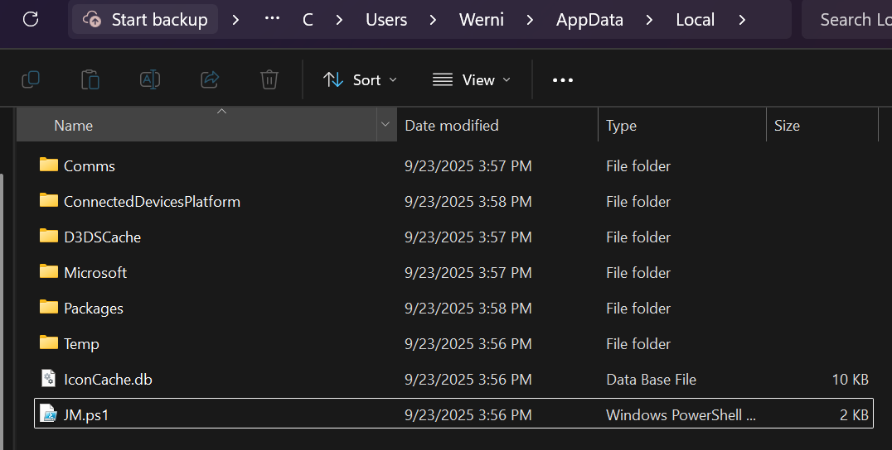
- None of the files seemed of interest for Flag 8, except for one: located in `The_Enduring_Echo\C\Users\Werni\AppData\Local` directory, there was a Windows PowerShell script named `JM.ps1`.

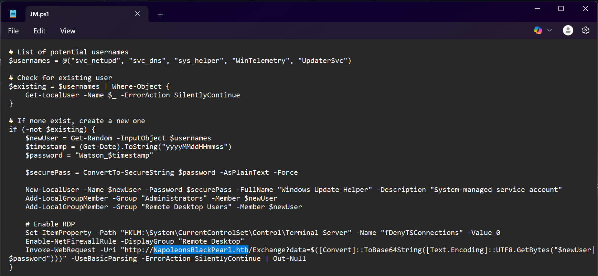
- Upon opening this `JM.ps1` file in Notepad, there is a domain name located in the parameters of an `Invoke-WebRequest` command.

**Answer:** `NapoleonsBlackPearl.htb`  

---

## 🚩 Flag 9: Generated Password

**Question:** What password did the attacker's script generate for the newly created user? (string)  

**Walkthrough:** 
- The Windows PowerShell script named `JM.ps1` contains a function in which a username and password are generated for the new user.

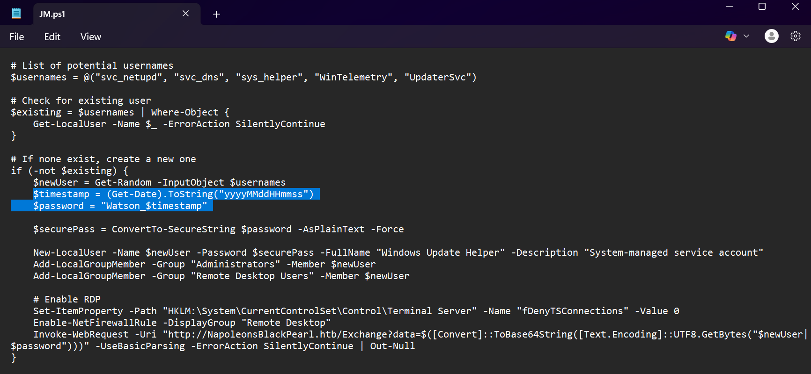
- Looking at this script, we can see that the generated password is a concatenation of `Watson_` and the timestamp of the date the script was run (in the format `"yyyyMMddHHmmss"`).
- To find out the password, we will have to search the logs for when this script was executed to get an exact timestamp and find the credentials of this new user.

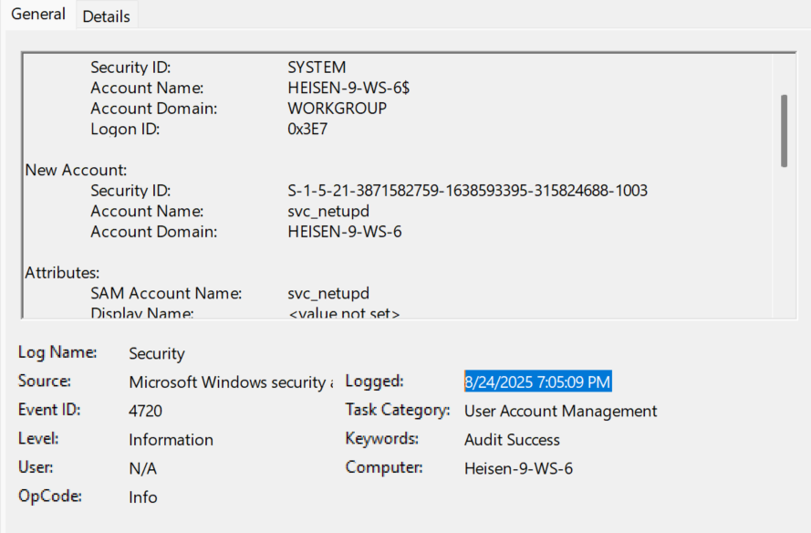
- In the `Security.evtx` logs, we can see an exact timestamp of when the new user from Flag 7 was created.
- The time given for the `svc_netupd` user creation is `8/24/2025 7:05:09 PM`.
- To find the timezone of these logs, we will need to look in the `SYSTEM` registry hive (using Zimmerman's Registry Explorer v2.1.0).

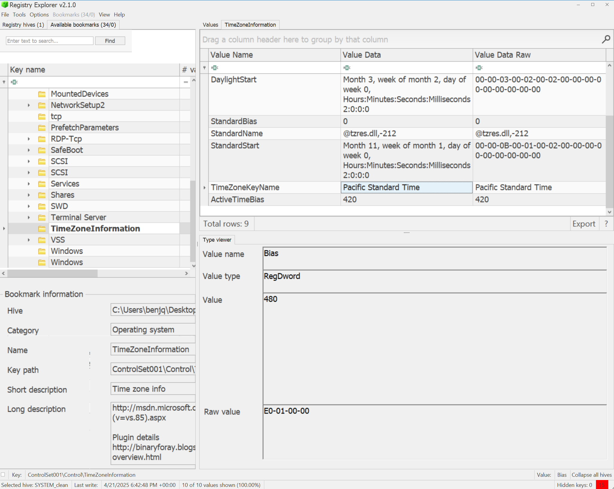
- Knowing the timezone is in Pacific Standard Time, my system is in Eastern Standard Time.
- We need to convert the `8/24/2025 7:05:09 PM` in EST to PST to follow the system guidelines.
- This would mean the correct system time in the `SYSTEM` timezone is `8/24/2025 4:05:09 PM`.
- Converting this to 24-hour format, we get `8/24/2025 16:05:09 PM`.
- In `"yyyyMMddHHmmss"` form, this is equivalent to `20250824160509`.
- Concatenating the `Watson_` to the front of this timestamp, the password for the new user is `Watson_20250824160509`.

**Answer:** `Watson_20250824160509`  

---

## 🚩 Flag 10: Pivot Host

**Question:** What was the IP address of the internal system the attacker pivoted to? (IPv4 address) 

**Walkthrough:** 
- The IP address of the interal system that the attacker pivoted to likely had to be an IP address that had been used regularly prior to the attack.
- If we look through the Administrator user's files, we can see a folder named `.ssh`.
- SSH is a network protocol enabling secure, remote access between computers, and it is commonly used for logging in, running commands, or transferring files.
- In this folder, at the filepath `The_Enduring_Echo\C\Users\Administrator\.ssh`, we can see there is one file called `known_hosts`.

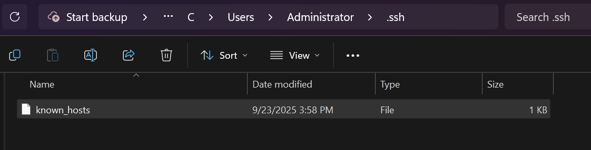
- I opened this file in Notepad to inspect it futher.

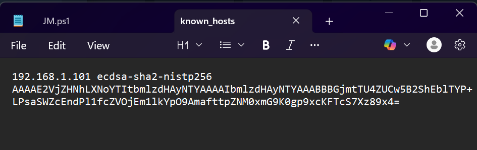
- The contents are a hostname, key type, and base64-encoded public key.
- This IPv4 address found correlated with a "known_host" on the Administrator user, giving it a strong likelihood of being the IP address of the internal system that the attacker pivoted to.

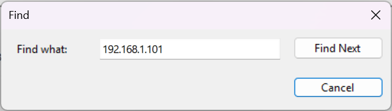
- I took this IP address and utilized the `Find` action to see if there was any trace of it being used in the `Security.evtx` logs during the attack.
- At `8/24/2025 7:10:05 PM`, there is a log containing a command in which the compromised host was forwarding incoming connections to `192.168.1.101:22`, the internal pivot target.

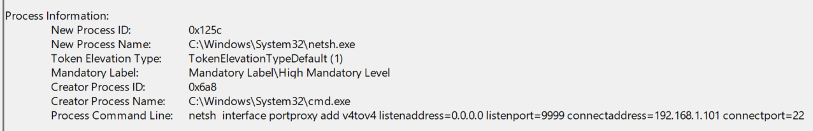
- This lines up with the timeframe of the attack.

**Answer:** `192.168.1.101`  

---

## 🚩 Flag 11: Forwarded Port

**Question:** Which TCP port on the victim was forwarded to enable the pivot? (port 0-65565)  

**Walkthrough:** 
- Since we now know the command the attacker used to forward incoming connections to the IP address he pivoted to, we can inspect this command further to find the TCP port that was forwarded as well to enable the pivot.

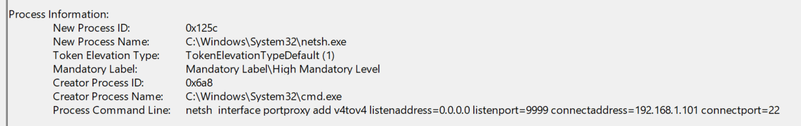
- The full command the attacker used is as follows: `netsh  interface portproxy add v4tov4 listenaddress=0.0.0.0 listenport=9999 connectaddress=192.168.1.101 connectport=22`.
- We can see the `listenport` is specified in this command, giving us the answer to this question.

**Answer:** `9999`  

---

## 🚩 Flag 12: PortProxy Key

**Question:** What is the full registry path that stores persistent IPv4→IPv4 TCP listener-to-target mappings? (HKLM\...\...)

**Walkthrough:** 
- On our host, in the SYSTEM registry hive, we can see that the registry location is `HKLM\SYSTEM\ControlSet001\Services\PortProxy\v4tov4\tcp`.

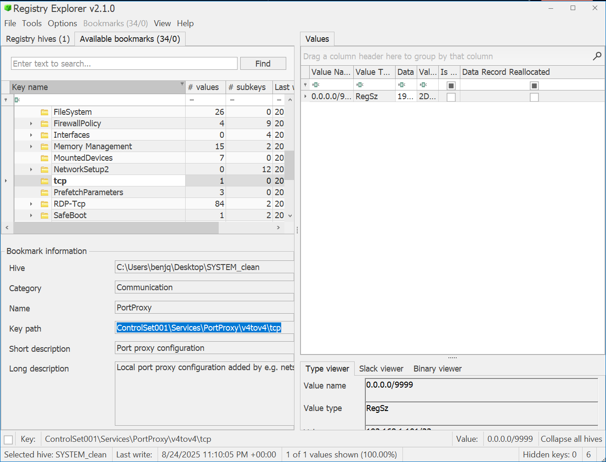
- However, this is NOT the answer for the flag.
- The SYSTEM registry hive stores multiple control sets, and these are just the snapshots of the system configuration taken at different times.
- Our answer needs to be related to LIVE hosts, which use `CurrentControlSet` rather than `ControlSet00X`.

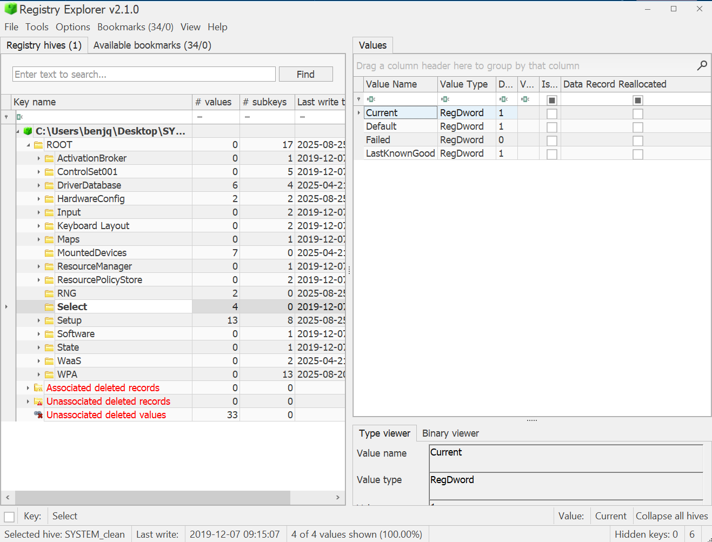
- This is stored in the `HKLM\SYSTEM\Select` key within the SYSTEM registry hive, under the "Current" Value Name's Data field.
- With this in mind, the live, full registry path is `HKLM\SYSTEM\CurrentControlSet\Services\PortProxy\v4tov4\tcp`.

**Answer:** `HKLM\SYSTEM\CurrentControlSet\Services\PortProxy\v4tov4\tcp`  

---

## 🚩 Flag 13: ATT&CK ID

**Question:** What is the MITRE ATT&CK ID associated with the previous technique used by the attacker to pivot to the internal system? (Txxxx.xxx)

**Walkthrough:** 
- Since we have the attack technique used by the attacker to pivot to the internal system, `PortProxy\v4tov4\tcp`, we can use Google to find the MITRE ATT&CK ID.

- In the search results, the MITRE ATT&CK website was among the sites listed:

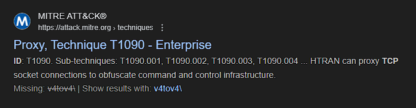

- On the site itself (as well as in the link to the site itself), we are given the ID associated with the `Internal Proxy` technique the attacker used.

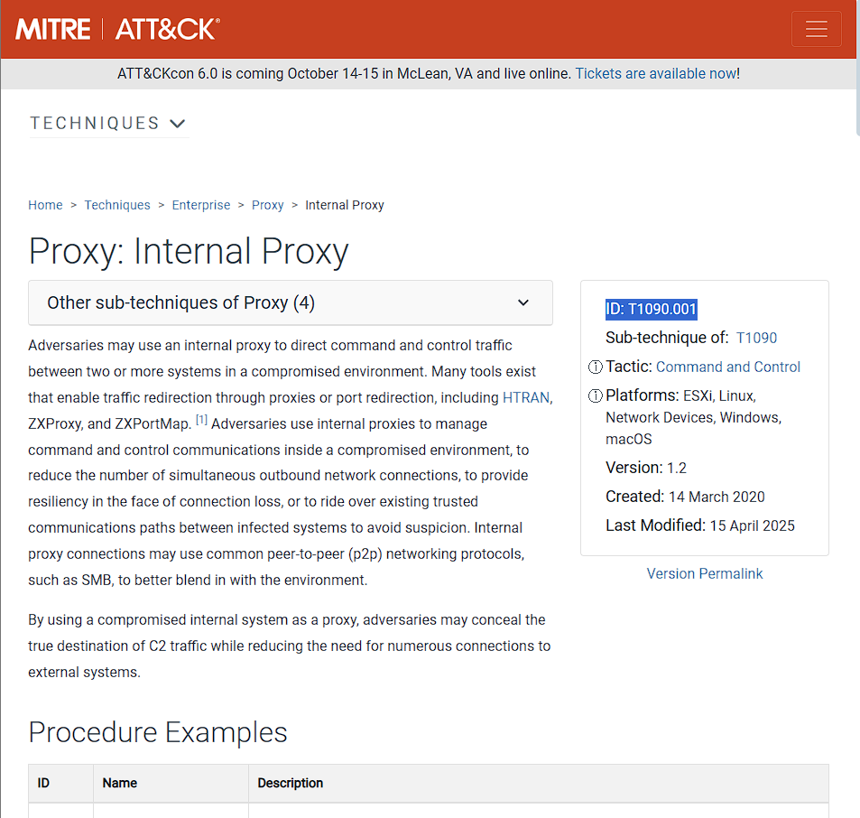

**Answer:** `T1090.001`  

---

## 🚩 Flag 14: Enable Cmdline
**Question:** Before the attack, the administrator configured Windows to capture command line details in the event logs. What command did they run to achieve this? (command)

**Walkthrough:** 
- For the final question, we need to check the `Security.evtx` logs for a policy change where the administrator configured the event logs to capture command-line details.
- To find this, we can use Event ID `4719` ("System audit policy was changed").

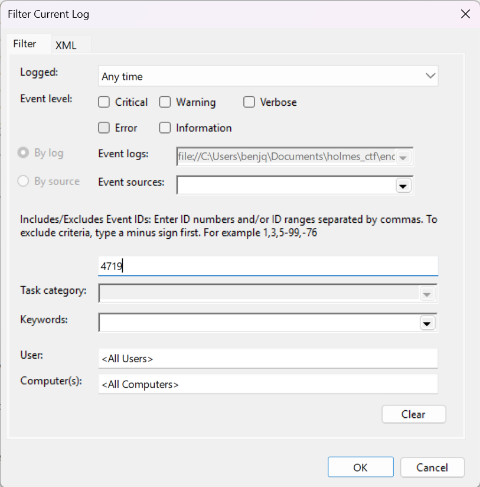
- There is only one log returned, and it happened before the attack took place, so it is safe to say this is where the administrator configured the event logs.

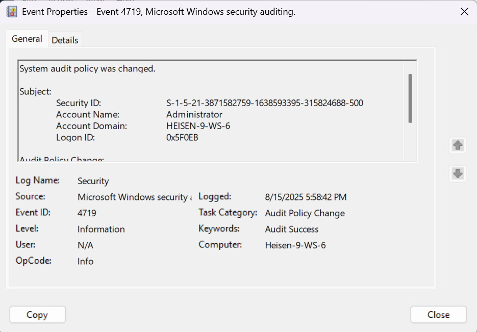
- We can't find the actual command from this, however, so we need to check another place.
- There is a `ConsoleHost_history.txt` file in the Administrator user profile (`The_Enduring_Echo\C\Users\Administrator\AppData\Roaming\Microsoft\Windows\PowerShell\PSReadline`, so this definitely could contain the information we need to find this command.

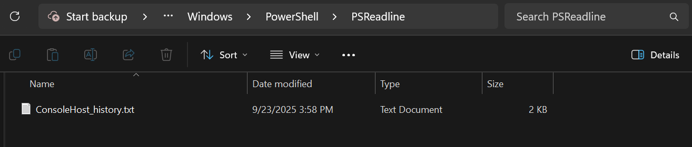
- If we open this file, we can see a ton of commands executed on the Administrator user profile.
- Line 37 has a command related to configuring system policies: `reg add "HKLM\SOFTWARE\Microsoft\Windows\CurrentVersion\Policies\System" /v LocalAccountTokenFilterPolicy /t REG_DWORD /d 1 /f`

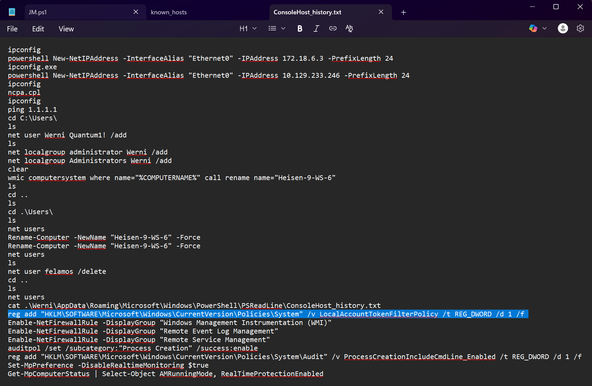
- In the `Security.evtx` logs, there is only one instance of system policies being changed, so this is the correct command.

**Answer:** `reg add "HKLM\Software\Microsoft\Windows\CurrentVersion\Policies\System\Audit" /v ProcessCreationIncludeCmdLine_Enabled /t REG_DWORD /d 1 /f`  

---

**Next challenge writeup:** [Holmes — The Tunnel Without Walls 🌌](./holmes_tunnel_without_walls.md)

