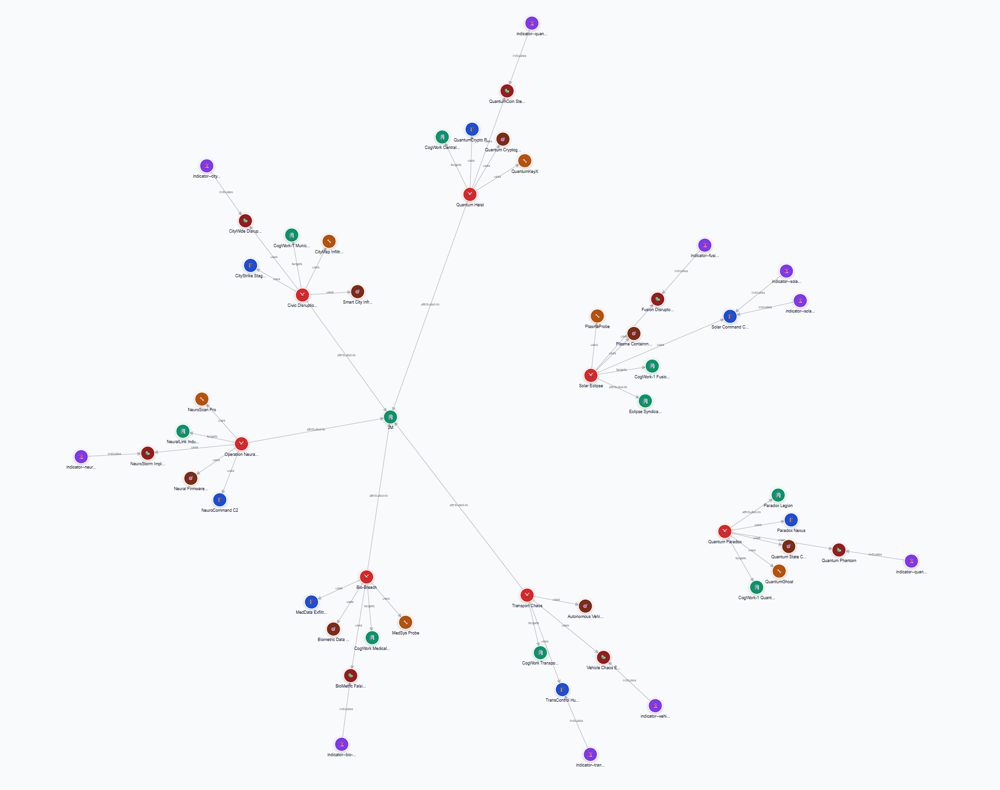

# Holmes CTF: "The Card" 🃏

**Author:** @benjqminn  
**Prompt:** Holmes receives a breadcrumb from Dr. Nicole Vale - fragments from a string of cyber incidents across Cogwork-1. Each lead ends the same way: a digital calling card signed JM.

**Summary:** Multi-stage web attack against Nicole Vale’s honeypot attributed to actor “JM”: initial reconnaissance (distinct User-Agent), WAF bypass with web shell deployment, database exfiltration, malware persistence, and infrastructure mapping via Cogwork platforms.

---

## 🚩 Flag 1: "Analyze the provided logs and identify what is the first User-Agent used by the attacker against Nicole Vale's honeypot. (string)"

**Walkthrough:** 
- To find Flag 1, we were asked to look through the logs given to find the "first User-Agent" used by the attacker against the honeypot.
- This task seemed quite simple, and once I downloaded the logs from the given "Scenario Files" section, I opened the log titled "access.log".
- Looking at line 1, we can see that the attacker used User-Agent `Lilnunc/4A4D - SpecterEye`.
- Therefore, the value for flag 1 is: `Lilnunc/4A4D - SpecterEye`

**Solution Line of `access.log`:** 
- `2025-05-01 08:23:12 121.36.37.224 - - [01/May/2025:08:23:12 +0000] "GET /robots.txt HTTP/1.1" 200 847 "-" "Lilnunc/4A4D - SpecterEye"`
---

## 🚩 Flag 2: "It appears the threat actor deployed a web shell after bypassing the WAF. What is the file name? (filename.ext)"

**Walkthrough:** 
- To find Flag 2, it is another case of looking through the logs.
- Since this question references the WAF, I naturally figured it would be best to look through `waf.log`
- A simple `CTRL + F` command searching for "WAF" allowed me to specify which lines contained any information about WAFs, so I started by going line-by-line (as this was a relatively small file).
- On `2025-05-15 11:25:01` the logs show a "CRITICAL" alert, with a "BYPASS" action (exactly what we are looking for). This line specifies a "Web shell creation detected", so I knew I was on the right track.
- The following line, at `2025-05-15 11:25:12`, another "BYPASS" action takes place. This log specifies a PHP web shell created, with the name `temp_4A4D.php`. This is the flag for our question.

**Solution Line of `waf.log`:** 
- `2025-05-15 11:25:12 [CRITICAL] waf.exec - IP 121.36.37.224 - Rule: WEBSHELL_DEPLOYMENT - Action: BYPASS - PHP web shell temp_4A4D.php created`
---

## 🚩 Flag 3: "The threat actor also managed to exfiltrate some data. What is the name of the database that was exfiltrated? (filename.ext)"

**Walkthrough:** 
- To find Flag 3, I kept looking through `waf.log`.
- We are looking for data exfiltration in particular this time, and something had caught my eye from before when I was looking for Flag 2.
- There is a rule in `waf.log` called "DATA_EXFILTRATION", and looking here was my first instinct.
- When we look at this line, occurring at `2025-05-15 11:24:34`, it gives an "Unknown Error". This line is illegible in the `waf.log` file, so I cross-checked the timestamps in the `application.log` file.
- In `application.log`, we can see that at `2025-05-15 11:24:34` there is a "Data exfiltration attempt from 121.36.37.224".
- The command was given (`'find /var/www -name "*.sql" -o -name "*.tar.gz" -o -name "*.bck"'`), but this didn't help much with finding the name of the database.
- Next, I tried the third file we were given: `access.log`.
- We can see that at the same time, the attacker used `"POST /api/v2/debug/exec HTTP/1.1" 200 512 "-" "Mozilla/5.0 (X11; Linux x86_64) AppleWebKit/537.36"`.
- They probed for backups and dumps; it didn’t give the DB name, but narrowed our search.
- Looking further in the logs, we see some `GET` commands.
- The attacker seemingly packed files using a web shell, and then a few logs later, we can see they downloaded the DB dump.
- **Packing the Files:** `2025-05-18 15:02:34 121.36.37.224 - - [18/May/2025:15:02:34 +0000] "GET /uploads/temp_4A4D.php?cmd=tar%20-czf%20/tmp/exfil_4A4D.tar.gz%20/var/www/html/config/%20/var/log/webapp/ HTTP/1.1" 200 128 "-" "Mozilla/5.0 (X11; Linux x86_64) AppleWebKit/537.36"`
- **Downloading the DB:** `2025-05-18 14:58:23 121.36.37.224 - - [18/May/2025:15:58:23 +0000] "GET /uploads/database_dump_4A4D.sql HTTP/1.1" 200 52428800 "-" "4A4D RetrieveR/1.0.0"`
- In this last line, we can see that there was a 52 MB `.sql` file downloaded.
- This correlates with the exfiltration, giving us the flag and name of the database file: `database_dump_4A4D.sql`.

**Solution Line of `access.log`:** 
- `2025-05-18 14:58:23 121.36.37.224 - - [18/May/2025:15:58:23 +0000] "GET /uploads/database_dump_4A4D.sql HTTP/1.1" 200 52428800 "-" "4A4D RetrieveR/1.0.0"`
---

## 🚩 Flag 4: "During the attack, a seemingly meaningless string seems to be recurring. Which one is it? (string)"

**Walkthrough:** 
- To find the 4th Flag, I moved into my terminal to make the search easier.
- From the first flag, one string stood out to me. When looking for the "first User-Agent", the solution `Lilnunc/4A4D - SpecterEye` contains the string `4A4D`. This string also appeared in the database dump from the last question, etc.
- I searched across all of the logs to find anything that wasn't a typical path, header, or filename using the command:
- `Select-String -Path .\access.log, .\application.log, .\waf.log -Pattern "4A4D" | Format-Table Filename, LineNumber, Line -AutoSize`
- This search query organized and specified each instance of this unfamiliar string, and proved that it showed up in many situations throughout the attack:
1. *User-Agent: `Lilnunc/4A4D - SpecterEye`*
2. *Web shell: `temp_4A4D.php`*
3. *DB dump: `database_dump_4A4D.sql`*
4. *Backup: `backup_2025_4A4D.tar.gz`*
5. *Downloader UA: `4A4D RetrieveR/1.0.0`*
-  Funnily enough, the flag for this question happens to be `4A4D`.

---

## 🚩 Flag 5: "OmniYard-3 (formerly Scotland Yard) has granted you access to its CTI platform. Browse to the first IP:port address and count how many campaigns appear to be linked to the honeypot attack."

**Walkthrough:** 
- To find the 5th Flag, we navigated to the designated `IP:port` that was given. 
- Upon opening the `IP:port` in the browser, we were met with a "CogWork-Intel Graph".
- This graph contained 63 entities and 7 different types. 

- From this graph, we can see that there is one central node with 5 different sub-nodes stemming from it. We can assume this is the specified honeypot attack.
- Based on this, the answer to this flag is `5`.

---

## 🚩 Flag 6: "How many tools and malware in total are linked to the previously identified campaigns? (number)"

**Walkthrough:** 
- The answer to this flag lies within the same graph that we used for the previous question. 

---

## TL;DR (Answers)

- **User-Agent (first used):** `Lilnunc/4A4D - SpecterEye`
- **Web shell filename:** `temp_4A4D.php`
- **Exfiltrated DB:** `database_dump_4A4D.sql`
- **Recurring string:** `4A4D`
- **OmniYard campaigns linked:** `TODO`
- **Tools + malware count:** `TODO`
- **Malware SHA-256:** `TODO`
- **C2 IP (from CogWork):** `TODO`
- **Persistence file path:** `TODO`
- **Open ports (CogNet scan):** `TODO`
- **Owning organization:** `TODO`
- **Banner string:** `TODO`

---

## Timeline of Events

---

## Evidence & Commands
