# Holmes CTF: "The Payload" 📦

**👤 Author:** Benjamin Taylor ([@benjqminn](https://github.com/benjqminn))

**🛡️ Team:** Sherlock's Homies  
- [Benjamin Taylor](https://www.linkedin.com/in/btayl106/)  
- [Greyson Brummer](https://www.linkedin.com/in/greyson-brummer-b82119301/)  
- [Jonathan Lutabingwa](https://www.linkedin.com/in/jonathan-lutabingwa/)  
- [Lansina Diakite](https://www.linkedin.com/in/lansina-diakite-7a673b202/)  
- [Shaunak Peri](https://www.linkedin.com/in/shaunak-peri-315744245/)

**🏆 Ranking:** 634 / 7,085 teams

**📝 Prompt:** With the malware extracted, Holmes inspects its logic. The strain spreads silently across the entire network. Its goal? Not destruction-but something more persistent…friends. NOTE: The downloaded file is active malware. Take the necessary precautions when attempting this challenge.

**📌 Summary:** 

**⚠️ DISCLAIMER:** This walkthrough was all completed inside of a Virtual Machine, as we are dealing with malware. Proceed with caution.

**🟥 Challenge Difficulty:** *HARD*

---

## 📋 TL;DR (Answers)

- **xx:** `ole32.dll`
- **xx:** `dabcd999-1234-4567-89ab-1234567890ff`
- **xx:** `xx`
- **xx:** `xx`
- **xx:** `xx`
- **xx:** `xx`
- **xx:** `xx`
- **xx:** `xx`
- **xx:** `xx`
- **xx:** `xx`

---

## 🚩 Flag 1: 

**Question:** During execution, the malware initializes the COM library on its main thread. Based on the imported functions, which DLL is responsible for providing this functionality? (filename.ext) 

**Walkthrough:**  
- To find this first answer, I downloaded the provided files.
- Inside of the `The_Payload.zip` file, upon extracting it, there are 3 files: `AetherDesk-v74-77.exe`, `AetherDesk-v74-77.pdb`, and `DANGER.txt`.

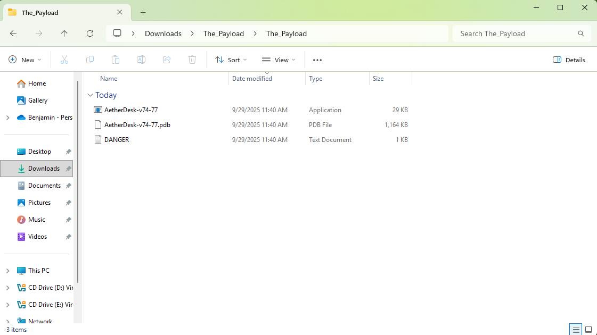
- Upon opening the `DANGER.txt` file, we are left a message (as the player) warning of the danger the artifacts for this challenge entail.

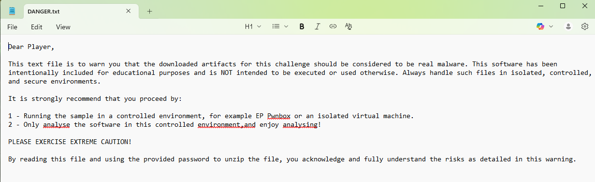
- **⚠️ DISCLAIMER:** You should be using a Virtual Machine of sorts to deal with the provided files for this challenge.
- To solve this first question, we need to use CFF Explorer to verify the DLL used.
- Upon opening the `AetherDesk-v74-77.exe` file, we can check the Import Directory to find the DLL.

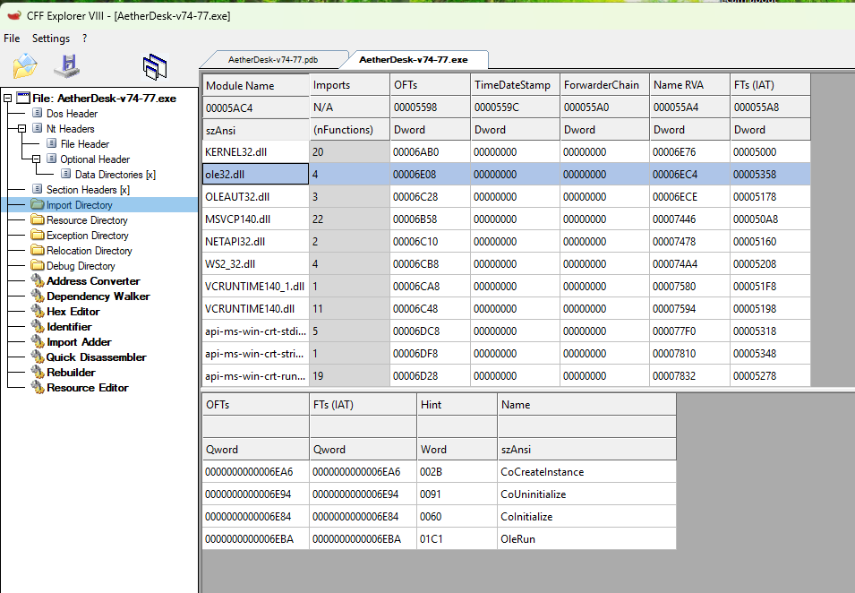
- For initializing the COM library on the main thread, `ole32.dll` is utilized.

**Answer:** `ole32.dll` 

---

## 🚩 Flag 2: 

**Question:** Which GUID is used by the binary to instantiate the object containing the data and code for execution? (********-****-****-****-************) 

**Walkthrough:**  
- To solve this next question, we are going to be using a tool called Ghidra.
- This tool is known for being a reverse engineering tool, ideal for analyzing binary files (perfect for our use case).

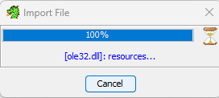
- Opening the `AetherDesk-v74-77.exe` file, upon scrolling to the decompiled view of the main function, we can find the GUID used to instantiate.

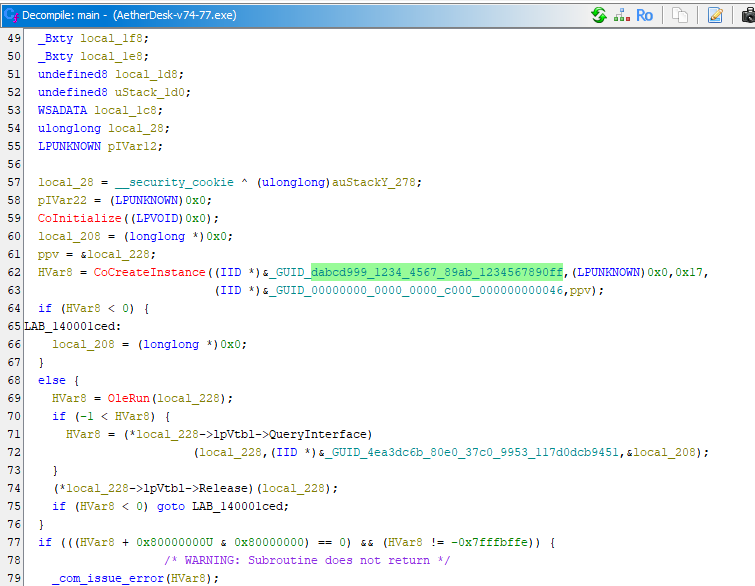

**Answer:** `dabcd999-1234-4567-89ab-1234567890ff`  

---

## 🚩 Flag 3: 

**Question:** Which .NET framework feature is the attacker using to bridge calls between a managed .NET class and an unmanaged native binary? (string) 

**Walkthrough:**  
- Within the code, there is an instance of `CoCreateInstance`, `OleRun`, and `QueryLibrary`.

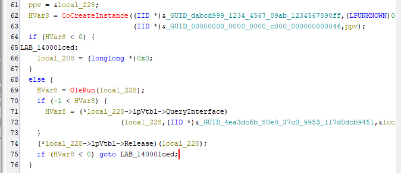
- Researching the similarity between these functions, we find that they are all from the COM library.

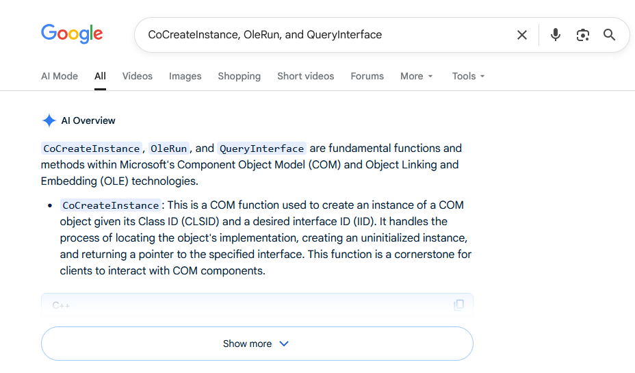
- A quick Google search inquiring about the COM library API for calls between .NET and unmanaged code led me to a section about "COM Interop".

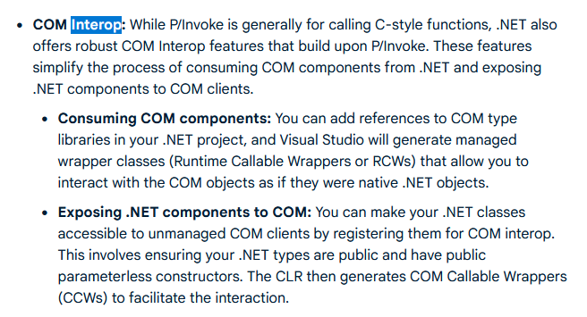

**Answer:** `Interop`  

---

## 🚩 Flag 4: 

**Question:** Which Opcode in the disassembly is responsible for calling the first function from the managed code? (** ** **) 

**Walkthrough:**  
- Reading through the decompiled `AetherDesk-v74-77.exe` file, we can see that the call to `.NET` happened in a line with the following: `(**(code **) (*local_208 + 0x68))(local_208,&local_210);`.
- This is the call to the first function from the managed code.

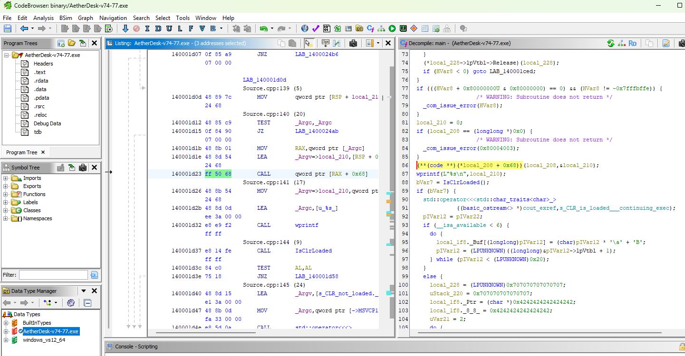
- Clicking on this line of code corresponds with the Opcode `ff 50 68`.

**Answer:** `ff 50 68`  

---

## 🚩 Flag 5: 

**Question:** Identify the multiplication and addition constants used by the binary's key generation algorithm for decryption. (*, **h) 

**Walkthrough:**  
- The answer to this flag is requiring us to find hex values, as specified in the flag requirements.
- The flag asks for `(*, **h)` format, with "h" meaning hexadecimal. 
- Reading through the main function, we can find decryption logic in a line of code.

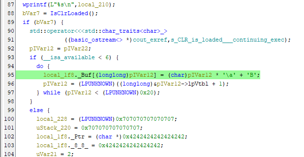
- In this line, `local_1f8._Buf[(longlong)pIVar12] = (char)pIVar12 * '\a' + 'B';`, we can see that `\a` and `B` are used as the constraints for the binary's key generation algorithm.
- We can write a quick line of code in Python to turn these ASCII values into Hex:

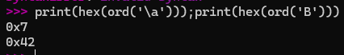
- With our two values, `\a` -> `0x7` and `B` -> `0x42`, we just have to format our response for the flag.

**Answer:** `7, 42h`  

---

## 🚩 Flag 6: 

**Question:** Which Opcode in the disassembly is responsible for calling the decryption logic from the managed code? (** ** **) 

**Walkthrough:**  
- Once again, this question is pretty straightforward, and the decryption logic is found in the main function.

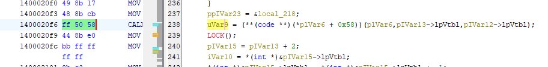

**Answer:** `ff 50 58`  

---

## 🚩 Flag 7: 

**Question:** Which Win32 API is being utilized by the binary to resolve the killswitch domain name? (string) 

**Walkthrough:**  
- A few lines above the answer for the last flag, there is a block of code that contains a string of interest.

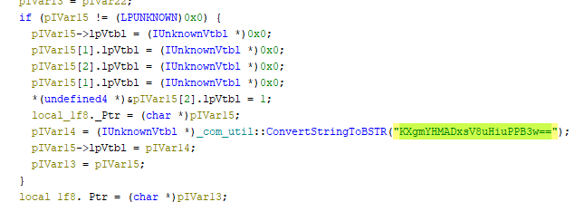
- This block of code essentially overwrites a structure that looks like an array of COM `IUnknown` entries, then stores a BSTR pointer into the spot for a vtable pointer.
- After inspecting the binary imports, I found 3 relevant ones: `WSAStratup`, `WSACleanup`, and `getaddrinfo`.
- `getaddrinfo` is used for DNS resolution, and the decoded string is supplied to this getaddrinfo (which is an API from Win32).

**Answer:** `getaddrinfo`  

---

## 🚩 Flag 8: 

**Question:** Which network-related API does the binary use to gather details about each shared resource on a server? (string) 

**Walkthrough:**  
- xxx

**Answer:** `xxx`  

---

## 🚩 Flag 9: 

**Question:** Which Opcode is responsible for running the encrypted payload? (** ** **) 

**Walkthrough:**  
- xxx

**Answer:** `xxx`  

---

## 🚩 Flag 10: 

**Question:** Find → Block → Flag: Identify the killswitch domain, spawn the Docker to block it, and claim the flag. (HTB{*******_**********_********_*****}) 

**Walkthrough:**  
- xxx

**Answer:** `xxx`  

---

**Back to Main Page:** [Holmes CTF 2025](./index.md)
