# Holmes CTF: "The Tunnel Without Walls" 🌌

**👤 Author:** Benjamin Taylor ([@benjqminn](https://github.com/benjqminn))

**🛡️ Team:** Sherlock's Homies  
- [Benjamin Taylor](https://www.linkedin.com/in/btayl106/)  
- [Greyson Brummer](https://www.linkedin.com/in/greyson-brummer-b82119301/)  
- [Jonathan Lutabingwa](https://www.linkedin.com/in/jonathan-lutabingwa/)  
- [Lansina Diakite](https://www.linkedin.com/in/lansina-diakite-7a673b202/)  
- [Shaunak Peri](https://www.linkedin.com/in/shaunak-peri-315744245/)

**🏆 Ranking:** 634 / 7,085 teams

**📝 Prompt:** A memory dump from a connected Linux machine reveals covert network connections, fake services, and unusual redirects. Holmes investigates further to uncover how the attacker is manipulating the entire network!

**📌 Summary:** Memory analysis revealed an attacker establishing an SSH foothold, running reconnaissance, escalating via stolen credentials, installing a rootkit from Pastebin, reconfiguring network services, and redirecting software updates to deliver a supply-chain attack.

**🟥 Challenge Difficulty:** *HARD*

---

## 📋 TL;DR (Answers)

- **Linux kernel version:** `5.10.0-35-amd64`
- **Attacker shell PID:** `13608`
- **Escalated credentials (user:password):** `jm:WATSON0`
- **Malicious file full path:** `/usr/lib/modules/5.10.0-35-amd64/kernel/lib/Nullincrevenge.ko`
- **Author email:** `i-am-the@network.now`
- **Package name and PID:** `dnsmasq,38687`
- **Compromised workstation hostname:** `Parallax-5-WS-3`
- **Portal username:** `mike.sullivan`
- **Update endpoint:** `/win10/update/CogSoftware/AetherDesk-v74-77.exe`
- **Original domain, final redirect:** `updates.cogwork-1.net,13.62.49.86:7477`

---

## 🚩 Flag 1: Kernel Version

**Question:** What is the Linux kernel version of the provided image? (string)  

**Walkthrough:**  
- To start this challenge, we are given a single file named `memdump.mem` with a size of 4,294,436,992 bytes.
- In Ubuntu, I changed the directory to my Volatility3 folder.
- I also copied the `memdump.mem` file into a new file I could work on, named `memdump_work.mem`, so as not to modify the contents of the original file.
- To obtain the Linux kernel version value, I ran the Volatility3 `banners` plugin.

- As we can see, the Linux version specified is "Linux version 5.10.0-35-amd64".

**Answer:** `5.10.0-35-amd64`  

---

## 🚩 Flag 2: Attacker Shell PID

**Question:** The attacker connected over SSH and executed initial reconnaissance commands. What is the PID of the shell they used?  

**Walkthrough:**  
- For Flag 2, we are checking the PID of the shell that the attacker used when they connected over SSH to execute their initial reconnaissance commands.
- First, after identifying which profile is necessary to complete this challenge, I downloaded the required file, placed it in Volatility3's `Symbols` directory, and extracted the `.json` file.
- Here is a link to the repository I found containing the symbol file: https://github.com/Abyss-W4tcher/volatility3-symbols/tree/master/Debian/amd64/5.10.0/35
- Using `linux.pstree`, I was able to check the processes and extract the necessary information.

- As we can see in the list of processes, the bash process 13608 is a child of an sshd process chain (sshd(13585) -> sshd(13607) -> bash(13608)).
- This is almost definitely the PID that we are looking for, and after confirming the flag, it is correct.

**Answer:** `13608`  

---

## 🚩 Flag 3: Escalated Credentials

**Question:** After the initial information gathering, the attacker authenticated as a different user to escalate privileges. Identify and submit that user's credentials.  

**Walkthrough:**  
- To find Flag 3, we must first use the `linux.bash` plugin to list the executed commands.
- Dumping the bash entries and using `grep` for credential-like uses provides us with one command that stands out.

- The attacker used the `su jm` command to switch to the `jm` user.
- Even knowing this, though, we still don't have the password.
- For this, we can use `strings` to see if it is in the memory.

- The line that we found is `jm:$1$jm$poAH2RyJp8ZllyUvIkxxd0:0:0:root:/root:/bin/bash`.
- This gives us the hash for the password.
- Since the password begins with $1$, we can tell that it is hashed with MD5-crypt (formally known as MD5-based crypt(3)).
- Now that we have the hashed password, we can use `hashcat` to crack it.

- Our password hash was successfully cracked!
- `$1$jm$poAH2RyJp8ZllyUvIkxxd0` translates to `WATSON0`.
- Now, we have our username:password combination that the flag requires (therefore completing this question).

**Answer:** `jm:WATSON0`  

---

## 🚩 Flag 4: Malicious File Path

**Question:** The attacker downloaded and executed code from Pastebin to install a rootkit. What is the full path of the malicious file?  

**Walkthrough:**  
- Since we know that the rootkit was installed, we can use the `linux.malware.check_modules` plugin to see if the rootkit is easily visible.

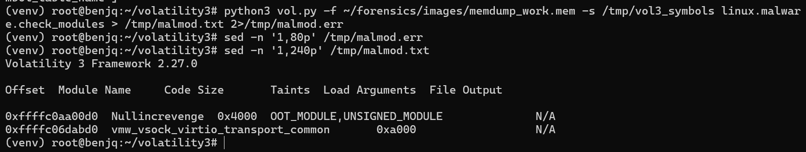
- We can see here that there are two queries returned from this command.
- The first returned, `Nullincrevenge`, is one we can note as being suspicious.
- In the storyline for this CTF, `NULLINC` was named as a key event.

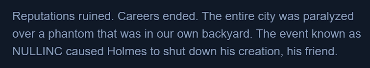
- Knowing this is the name of the module, we can use the `linux.pagecache.Files` plugin to identify the malicious file.

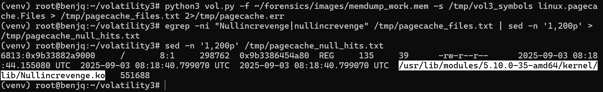
- The malicious file is listed, giving us the answer for our flag.
  
**Answer:** `/usr/lib/modules/5.10.0-35-amd64/kernel/lib/Nullincrevenge.ko`  

---

## 🚩 Flag 5: Author Email

**Question:** What is the email account of the alleged author of the malicious file?  

**Walkthrough:**  
- Since we know the location of the malicious file now, we can try and extract it from memory.
- This can be done by using `linux.pagecache.inodePages`.
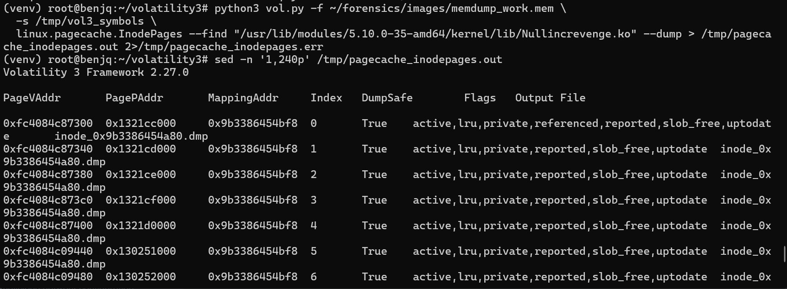

-  Then, we can inspect futher using old strings.

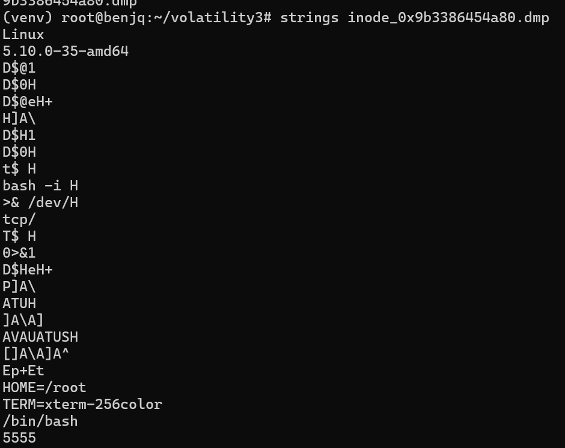
-  Now, we have the "author".

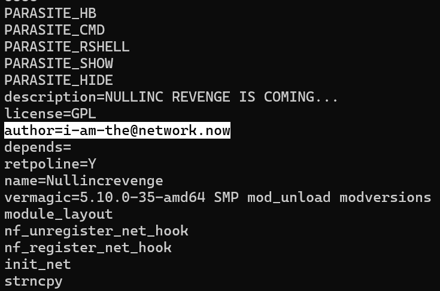
-  This leaves us the email account of the alleged author of this malicious file

**Answer:** `i-am-the@network.now`  

---

## 🚩 Flag 6: Package Name and PID

**Question:** The next step in the attack involved issuing commands to modify the network settings and installing a new package. What is the name and PID of the package?  

**Walkthrough:**  
- Using the `linux.bash` plugin output and searching for package-install commands, we know that the attacker installed a certain package: 
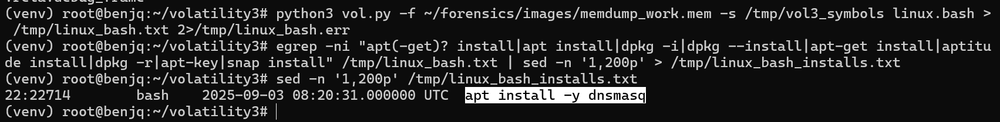

- Now, knowing the name of the package, we can search the `/tmppstree.txt` file we previously generated for any lines containing "apt", "dpkg", or "dnsmasq".
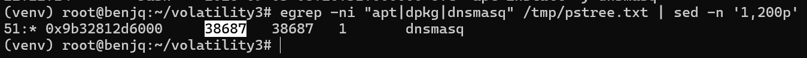

- We can see a process tree entry for `dnsmasq` in the return value from the command, giving us the PID of the dnsmasq process.

- 
**Answer:** `dnsmasq,38687`  

---

## 🚩 Flag 7: 

**Question:** Clearly, the attacker's goal is to impersonate the entire network. One workstation was already tricked and got its new malicious network configuration. What is the workstation's hostname?  

**Walkthrough:**  
- Using the `linux.bash` plugin output, with the `iptables` configuration, we can assume that the LAN IP range is 192.168.211.0/24.

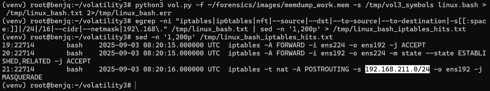
- Now, with this in mind, we can try to use this IP range against the memdump file.
- This can be done using `strings` and `grep`.

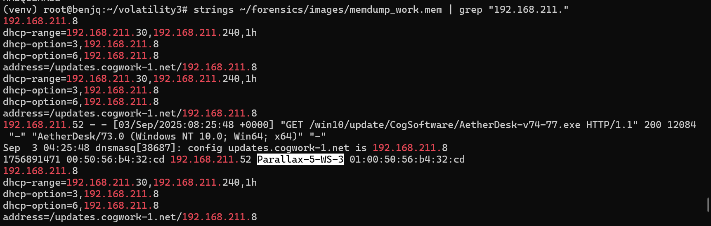
- We can now see the hostname of the network that was tricked and provided a new, malicious network configuration.

**Answer:** `Parallax-5-WS-3`  

---

## 🚩 Flag 8: Portal Username

**Question:** After receiving the new malicious network configuration, the user accessed the City of CogWork-1 internal portal from this workstation. What is their username?  

**Walkthrough:**  
- To find the username for this flag, we can again use `strings`.
- This time, however, we will also be using `egrep` and a few different variations of "user=", or "username=", since we know the user has accessed the internal portal at this point.
- We are trying to look for URL parameters, as it is assumed the user has logged in.

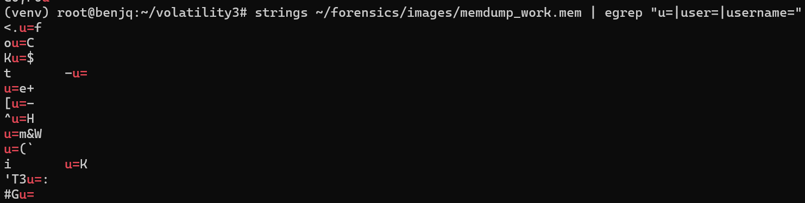
- After looking through the many, many lines of results, there is a username & password field given to us:

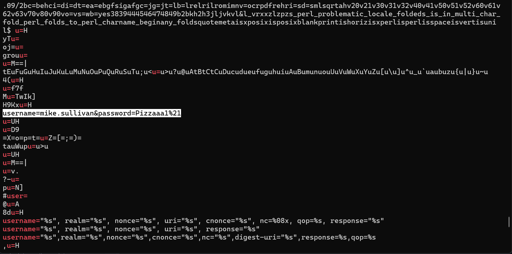
- This is the answer for our flag, and is the correct username of the user who accessed the City of CogWork-1 internal portal.

**Answer:** `mike.sullivan`  

---

## 🚩 Flag 9:

**Question:** Finally, the user updated a software to the latest version, as suggested on the internal portal, and fell victim to a supply chain attack. From which Web endpoint was the update downloaded? 

**Walkthrough:**  
- The answer to this flag lies in a search we previously executed to find Flag 7, involving the LAN IP range.
- Looking into the output of our previously executed command/search, we can find this Web endpoint from which the update was downloaded.

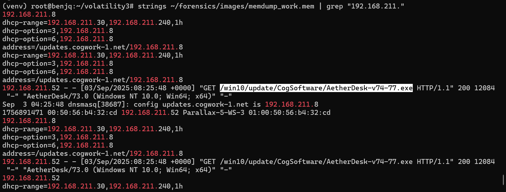

**Answer:** `/win10/update/CogSoftware/AetherDesk-v74-77.exe`  

---

## 🚩 Flag 10: Redirect Domain and IP

**Question:** To perform this attack, the attacker redirected the original update domain to a malicious one. Identify the original domain and the final redirect IP address and port.  

**Walkthrough:**  
- To find the original domain name, we can once again use the same query as we did to find the previous flag.

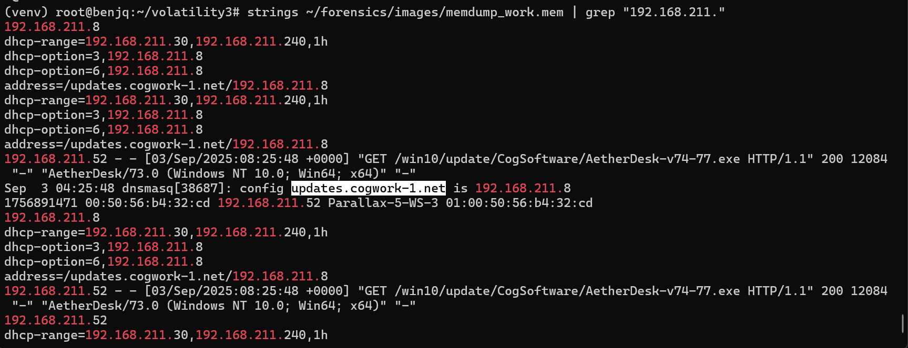
- The original domain name is `updates.cogwork-1.net`.

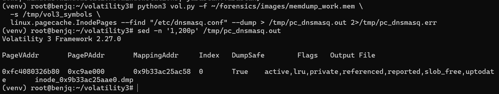
- Just to make sure, we can extract the `/etc/dnsmasq.conf` file.

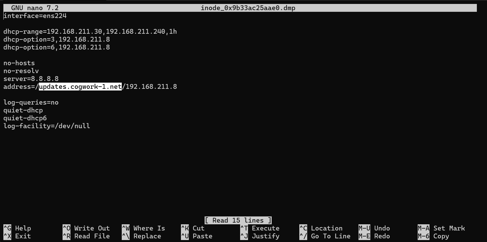
- Looking at the contents of this file, we find the same original domain name of `updates.cogwork-1.net`.
- This confirms this part of the flag.
- Now, using the `linux.bash` plugin, we know that the attacker not only opened, but also edited and then removed the `/tmp/default.conf` file.

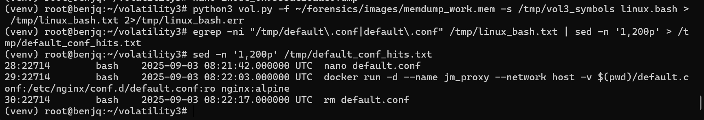
- We can try to extract this file from memory to hopefully give us the final redirect IP address/port.

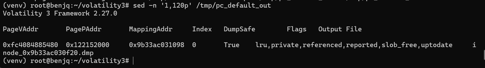
- Now, using `nano`, we can check the output of this file to grab the IP:port value.

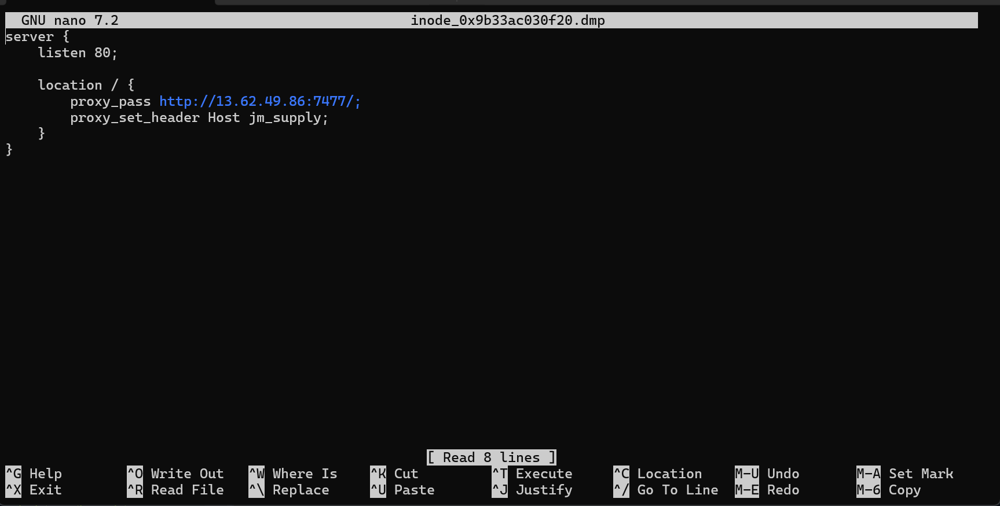
- Combining the original domain with the IP:port value, we have our final flag for this challenge.

**Answer:** `updates.cogwork-1.net,13.62.49.86:7477`  

---

