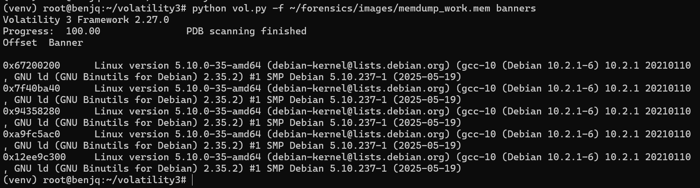
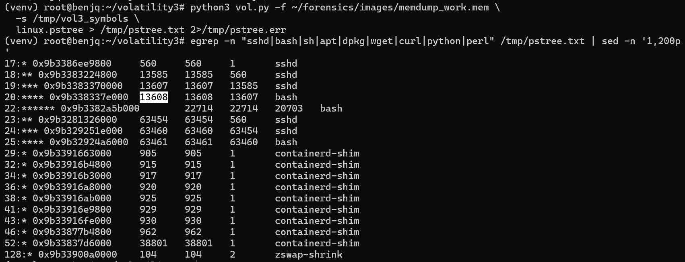
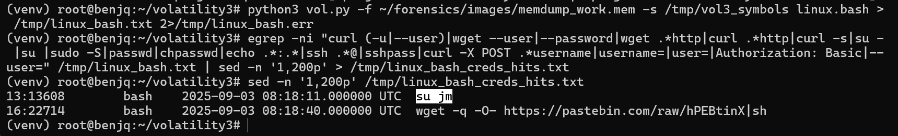
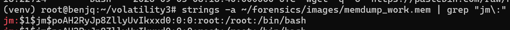
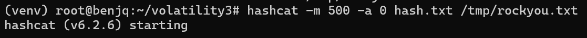
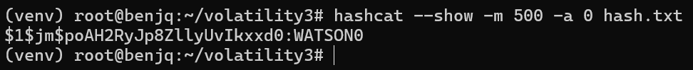

# Holmes CTF: "The Tunnel Without Walls" 🌌

**👤 Author:** Benjamin Taylor ([@benjqminn](https://github.com/benjqminn))

**🛡️ Team:** Sherlock's Homies  
- [Benjamin Taylor](https://www.linkedin.com/in/btayl106/)  
- [Greyson Brummer](https://www.linkedin.com/in/greyson-brummer-b82119301/)  
- [Jonathan Lutabingwa](https://www.linkedin.com/in/jonathan-lutabingwa/)  
- [Lansina Diakite](https://www.linkedin.com/in/lansina-diakite-7a673b202/)  
- [Shaunak Peri](https://www.linkedin.com/in/shaunak-peri-315744245/)

**🏆 Ranking:** 634 / 7,085 teams

**📝 Prompt:** A memory dump from a connected Linux machine reveals covert network connections, fake services, and unusual redirects. Holmes investigates further to uncover how the attacker is manipulating the entire network!

**📌 Summary:** Memory analysis revealed an attacker establishing an SSH foothold, running reconnaissance, escalating via stolen credentials, installing a rootkit from Pastebin, reconfiguring network services, and redirecting software updates to deliver a supply-chain attack.

---

## 📋 TL;DR (Answers)

- **Linux kernel version:** `5.10.0-35-amd64`
- **Attacker shell PID:** `<<<ANSWER>>>`
- **Escalated credentials (user:password):** `<<<ANSWER>>>`
- **Malicious file full path:** `<<<ANSWER>>>`
- **Author email:** `<<<ANSWER>>>`
- **Package name and PID:** `<<<ANSWER>>>`
- **Compromised workstation hostname:** `<<<ANSWER>>>`
- **Portal username:** `<<<ANSWER>>>`
- **Update endpoint:** `<<<ANSWER>>>`
- **Original domain, final redirect:** `<<<ANSWER>>>`

---

## 🚩 Flag 1: Kernel Version

**Question:** What is the Linux kernel version of the provided image? (string)  

**Walkthrough:**  
- To start this challenge, we are given a single file named `memdump.mem` with a size of 4,294,436,992 bytes.
- In Ubuntu, I changed the directory to my Volatility3 folder.
- I also copied the `memdump.mem` file into a new file I could work on, named `memdump_work.mem`, so as not to modify the contents of the original file.
- To obtain the Linux kernel version value, I ran the Volatility3 `banners` plugin.

- As we can see, the Linux version specified is "Linux version 5.10.0-35-amd64".

**Answer:** `5.10.0-35-amd64`  

---

## 🚩 Flag 2: Attacker Shell PID

**Question:** The attacker connected over SSH and executed initial reconnaissance commands. What is the PID of the shell they used?  

**Walkthrough:**  
- For Flag 2, we are checking the PID of the shell that the attacker used when they connected over SSH to execute their initial reconnaissance commands.
- First, after identifying which profile is necessary to complete this challenge, I downloaded the required file, placed it in Volatility3's `Symbols` directory, and extracted the `.json` file.
- Here is a link to the repository I found containing the symbol file: https://github.com/Abyss-W4tcher/volatility3-symbols/tree/master/Debian/amd64/5.10.0/35
- Using `linux.pstree`, I was able to check the processes and extract the necessary information.

- As we can see in the list of processes, the bash process 13608 is a child of an sshd process chain (sshd(13585) -> sshd(13607) -> bash(13608)).
- This is almost definitely the PID that we are looking for, and after confirming the flag, it is correct.

**Answer:** `13608`  

---

## 🚩 Flag 3: Escalated Credentials

**Question:** After the initial information gathering, the attacker authenticated as a different user to escalate privileges. Identify and submit that user's credentials.  

**Walkthrough:**  
- To find Flag 3, we must first use the `linux.bash` plugin to list the executed commands.
- Dumping the bash entries and using `grep` for credential-like uses provides us with one command that stands out.

- The attacker used the `su jm` command to switch to the `jm` user.
- Even knowing this, though, we still don't have the password.
- For this, we can use `strings` to see if it is in the memory.

- The line that we found is `jm:$1$jm$poAH2RyJp8ZllyUvIkxxd0:0:0:root:/root:/bin/bash`.
- This gives us the hash for the password.
- Since the password begins with $1$, we can tell that it is hashed with MD5-crypt (formally known as MD5-based crypt(3)).
- Now that we have the hashed password, we can use `hashcat` to crack it.

- Our password hash was successfully cracked!
- `$1$jm$poAH2RyJp8ZllyUvIkxxd0` translates to `WATSON0`.
- Now, we have our username:password combination that the flag requires (therefore completing this question).

**Answer:** `jm:WATSON0`  

---

## 🚩 Flag 4: Malicious File Path

**Question:** The attacker downloaded and executed code from Pastebin to install a rootkit. What is the full path of the malicious file?  

**Walkthrough:**  
- Since we know that the rootkit was installed, we can use the `linux.malware.check_modules` plugin to see if the rootkit is easily visible.
- 

**Answer:** `<<<ANSWER>>>`  

---

## 🚩 Flag 5: Author Email

**Question:** What is the email account of the alleged author of the malicious file?  

**Walkthrough:**  
- Extracted strings from the malicious script in memory.  
- Identified email pattern in metadata/comments.  

**Answer:** `<<<ANSWER>>>`  

---

## 🚩 Flag 6: Package Name and PID

**Question:** The next step in the attack involved issuing commands to modify the network settings and installing a new package. What is the name and PID of the package?  

**Walkthrough:**  
- Enumerated processes with `linux.pslist` and `linux.psaux`.  
- Spotted package manager process (`apt-get`/`dpkg`) installing malicious package.  

**Answer:** `<<<ANSWER>>>`  

---

## 🚩 Flag 7: Compromised Workstation Hostname

**Question:** What is the workstation's hostname?  

**Walkthrough:**  
- Extracted `/etc/hostname` contents from memory.  
- Verified with volatility `linux.envars`.  

**Answer:** `<<<ANSWER>>>`  

---

## 🚩 Flag 8: Portal Username

**Question:** After receiving the new malicious network configuration, the user accessed the City of CogWork-1 internal portal from this workstation. What is their username?  

**Walkthrough:**  
- Parsed HTTP POST request in memory for `username=` field.  
- Correlated with portal login session.  

**Answer:** `<<<ANSWER>>>`  

---

## 🚩 Flag 9: Update Endpoint

**Question:** From which Web endpoint was the update downloaded?  

**Walkthrough:**  
- Searched memory for `GET http` and `wget/curl` commands.  
- Identified endpoint used to fetch update.  

**Answer:** `<<<ANSWER>>>`  

---

## 🚩 Flag 10: Redirect Domain and IP

**Question:** To perform this attack, the attacker redirected the original update domain to a malicious one. Identify the original domain and the final redirect IP address and port.  

**Walkthrough:**  
- Found `Location:` header and `/etc/hosts` modification.  
- Extracted original domain + redirected IP:port mapping.  

**Answer:** `<<<ANSWER>>>`  

---

## 📌 Lessons Learned

- Memory forensics can reveal **cleartext credentials**, **malware paths**, and **network artifacts** missed by disk forensics.  
- SSH session analysis + process trees are crucial for spotting **attacker footholds**.  
- Supply-chain compromises often leverage **domain redirection**; defenders should monitor `/etc/hosts`, DNS anomalies, and unsigned updates.

---

