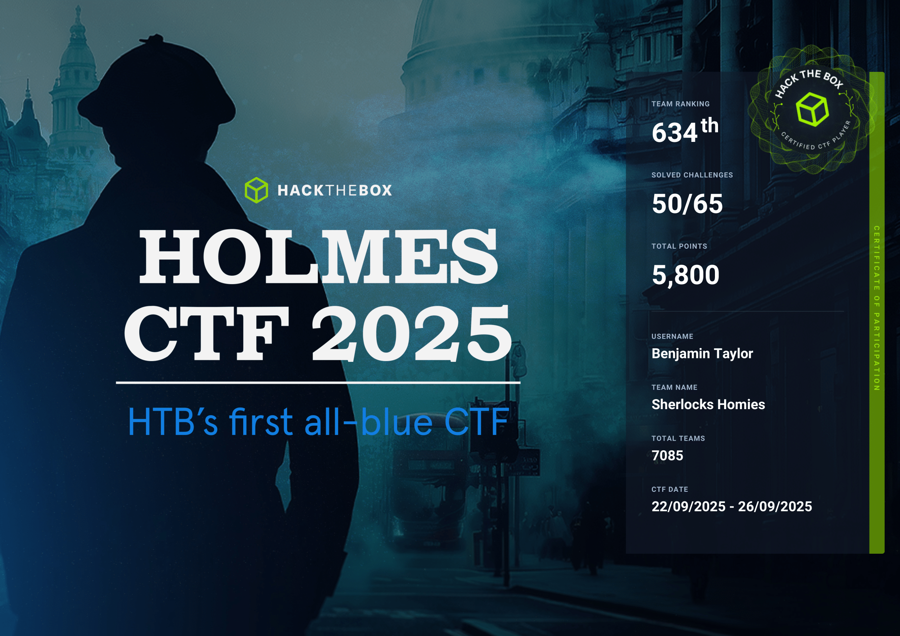

# Hack The Box: Holmes CTF 2025 (22/09/25 - 26/09/25) 🔎

**👤 Author:** Benjamin Taylor ([@benjqminn](https://github.com/benjqminn))

**🤝 Team:** Sherlock's Homies
- [Benjamin Taylor](https://www.linkedin.com/in/btayl106/)  
- [Greyson Brummer](https://www.linkedin.com/in/greyson-brummer-b82119301/)  
- [Jonathan Lutabingwa](https://www.linkedin.com/in/jonathan-lutabingwa/)  
- [Lansina Diakite](https://www.linkedin.com/in/lansina-diakite-7a673b202/)  
- [Shaunak Peri](https://www.linkedin.com/in/shaunak-peri-315744245/)

**🏆 Ranking**: 634 / 7,085 teams

---

**📋 Table of Contents**:
- 🟩 ["The Card" 🃏](./holmes_the_card.md)
- 🟨 ["The Watchman's Residue" 👮](./holmes_watchmans_residue.md)
- 🟩 ["The Enduring Echo" 🔊](./holmes_enduring_echo.md)
- 🟥 ["The Tunnel Without Walls" 🌌](./holmes_tunnel_without_walls.md)
- 🟥 ["The Payload" 📦](./holmes_the_payload.md)
  
--- 

**📝 Event Overview:**

**Welcome to HTB’s first-ever Blue CTF!**

This gauntlet of Sherlock-style challenges leads you through a case that has yet to be solved! 

Joining this event will allow you to investigate a range of scenarios: 

- Threat Intelligence
- SOC
- DFIR
- Malware Reversing 

With a team of 5, use your collective wit to dive into this forensic mystery and resolve an issue plaguing the city of Cogwork-1.  
Use your ace intellect to solve the crimes in Cogwork-1.

**Consider this our official debrief.**

Holmes left some vague context (as he does) before heading out into the field. Here’s what we know: 

We are getting strange readings from around the city; there were some targeted attacks on local businesses that seemed off. Who was chosen and the type of attack piqued Holmes’ interest, so he set out ahead of us. 

Odd though… he was muttering about something that had happened a while back, and he expressed distress about a personal AI he developed named WATSON. 

See, WATSON was his collaborative ally in his attempts to curb the crime happening around the city. However, some time ago, a catastrophic false-alert event caused by WATSON triggered a year-long manhunt for a breach that never existed. We were chasing ghosts.  

Reputations ruined. Careers ended. The entire city was paralyzed over a phantom that was in our own backyard. The event known as NULLINC caused Holmes to shut down his creation, his friend. 

So, we are just as confused about why he’d mention WATSON now, but you never can get a read on that man. 

Head out into the field and assist him in finding out what’s going on. We are counting on your detectives.  

--- 

